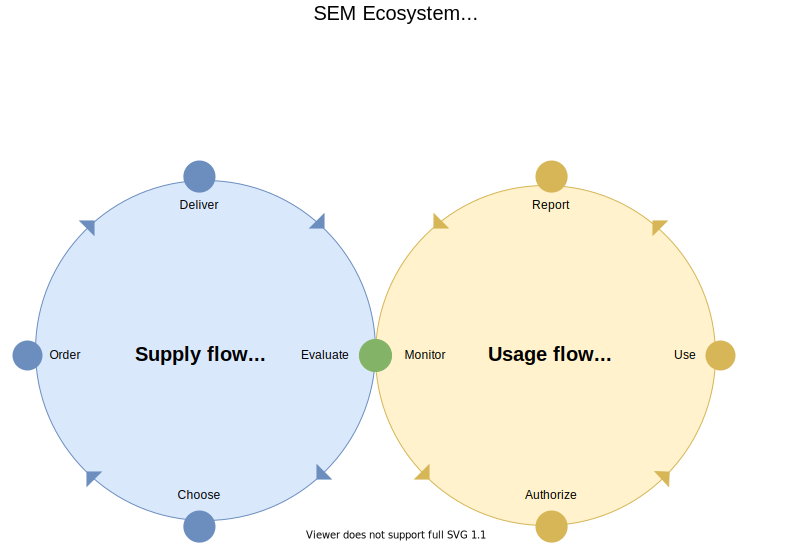

# SEM Ecosytem Standard

Version 0.1
Date issued: 1 December 2021
Status: CONCEPT
Author: @kvoer

## Abstract

TLDR for fast reading.

## Moving from a chain to an ecosystem

Short summary of the scope and reason for this standard.

## Enable data exchange in the supply and usage flow of learning materials

A typical school uses a broad range of learning materials from several educational publishers or platform suppliers. The SEM Ecosystem sets a standard for the exchange of data between all parties that play a key role in the use of (digital) learning materials within schools.

The SEM Ecosystem focuses on the minimal set of data required for two key processes within schools:
1. Supply of learning materials including the activities:
	a. Inform
	b. Order
	c. Deliver
	d. Evaluate
2. Usage of learning materials including the activities:
	a. Authorize
	b. Use
	c. Report progress and result
	d. Monitor

## Purpose of the SEM ecosystem

10 times better explained

## Structure of this repository

This repository consists of the following elements:
- [Beginner's Guide](beginners-guide.md) which explains all the concepts within the ecosystem in more detail.
- [Implementation Guide](implementation-guide.md) with practical advice for new parties.
- [Glossary](glossary.md) describing all terms and definitions used within the ecosystem

## Contributors

This standard is developed by members from [Stichting SEM](www.stichtingsem.org). The contributors to the SEM Ecosystem standard are:

| Name | Organization | Role | Alias |
|---|---|---|---|
| Clifton Cunningham | Infinitas Learning | Initiator | @cliftonc |
| Kees van Ginkel | Iddink Group | Editor | @mcginkel |
| Henk Haarsma | Noordhoff Uitgevers | Editor | @hhaarsma |
| Jorim van den Wijngaard | Topicus Education | Editor | @jorimvdw |