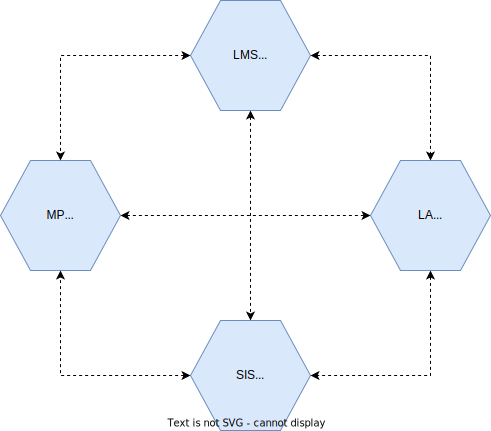
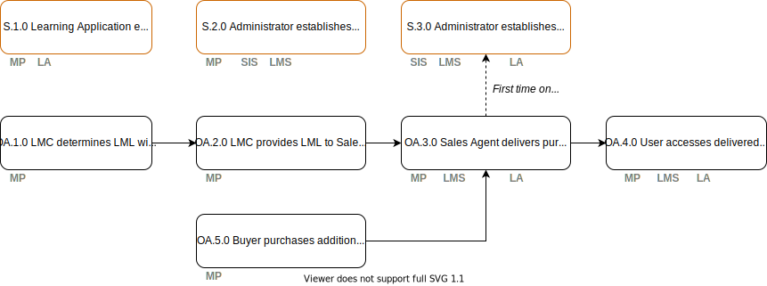

# Beginner's Guide

The beginner's guide gives you a high level overview of the scope and working of the SEM Ecosystem standard. This guide consists of the following paragraphs:
1. [Four servivces in the SEM Ecosystem](##four-services-in-the-sem-ecosystem)
2. [Actors in the SEM Ecosystem](##actors-in-the-sem-ecosystem)
3. [Processes and Use cases](##processes-and-use-cases)
4. [Join the SEM Foundation and adopt the SEM Ecosystem standard](##join-sem-foundation-and-adopt-the-sem-ecosystem-standard)

## Four services in the SEM Ecosystem

Services are provided to enable the roles to carrying out the processes. The services communicate directly with each other, under the direction and control of the school (where appropriate). Note that schools can select multiple of these services, so multiple Learning Applications, multiple Learning Management Systems, multiple Marketplaces and even multiple School Information Systems. Next to that schools can also omit one or more of these services. In theory the smallest set might be a single Marketplace and a single Learning Application.

| Service | Description |
|---|---|
| [Marketplace (MP)](documentation/services/marketplace.md) | A service that allows buyers to order, and then have delivered, learning materials (physical and digital) via either a LML (for start school year) or at any time of the year either at school level or via students / parents.  A school can contract with multiple marketplaces if desired. |
| [Learning Management System (LMS)](documentation/services/learning-management-system.md) | A service that allows users to schedule and manage the learning material that is assigned to students.  The Learning Management system can be populated with learning material that is selected or purchased from a Marketplace. |
| [Learning Application (LA)](documentation/services/learning-application.md) | A service that allows for the delivery of a specific learning activity in a digital environment and subject.  This service is typically accessed via a Learning Management system but can also be accessed directly. |
| [School Information System (SIS)](documentation/services/school-information-system.md) | A service that allows an administrator to manage the core data that the school needs to operate:  students, teachers, subjects, streams and classes.  This data is then provided (at the minimum level required and under the control of the school) to other services to allow them to function efficiently.  The SIS is the source of the ECK-ID |
| [Identity Provider (IdP)](documentation/services/identity-provider.md) | A service that provides Identity information about both students and teachers to the other services in the ecosystem.  This includes the ECK-ID as base for other associated data as needed (e.g. the students initials or class information). The IdP is not shown in the above diagram and not equal to the SIS service |

The particular mapping of this specification is as follows:

| API Definition                                                                                                           | Service Provider | Services Consuming |
|--------------------------------------------------------------------------------------------------------------------------|------------------|--------------------|
| [Events](https://stichtingsem.stoplight.io/docs/sem-technology-prototype/reference/events.v1.yaml)                       | all              | all                |
| [Webhooks](https://stichtingsem.stoplight.io/docs/sem-technology-prototype/reference/events.v1.yaml)                     | all              | all                |
| [SIS Data](https://stichtingsem.stoplight.io/docs/sem-technology-prototype/reference/sisdata.v1.yaml)                    | SIS              | MP, LA, LMS        |
| [Catalogue Data](https://stichtingsem.stoplight.io/docs/sem-technology-prototype/reference/catalogue.v1.yaml)            | LA               | MP, LMS            |
| [Course Data](https://stichtingsem.stoplight.io/docs/sem-technology-prototype/reference/coursee.v1.yaml)                 | LA               | LMS                |
| [Entitlements](https://stichtingsem.stoplight.io/docs/sem-technology-prototype/reference/entitlement.v1.yaml)            | MP               | LMS, LA            |
| [Usage](https://stichtingsem.stoplight.io/docs/sem-technology-prototype/reference/usage.v1.yaml)                         | LA               | MP, LMS            |
| [Progress & Results](https://stichtingsem.stoplight.io/docs/sem-technology-prototype/reference/progress-results.v1.yaml) | LA               | MP, LMS            |

## Actors in the SEM Ecosystem

| Role | Example Types | Description |
|---|---|---|
| [User](documentation/roles/user.md) | Student Teacher   | An individual, or member of an organisation, who is a user of a service provided by participants in the eco-system, this may or may not be connected to a purchase having occurred previously (either pre or post pay). |
| [Buyer](documentation/roles/buyer.md) | Student (VO+) Teacher Parent LMC | An individual, or representative of an organisation who they are purchasing on behalf of, who is the buyer of Learning Material via a Marketplace. |
| [Administrator (SIS)](documentation/roles/administrator.md)| Administrator | An individual who is responsible for the maintenance of data stored within a SIS. |
| [LMC](documentation/roles/lmc.md) | Leermiddelen coordinator (Learning Materials Coordinator) | An individual responsible for collating the needs of the teachers across departments in a school, and creating the list of material (mandatory and optional) that is then ordered for the school for a given school year. |
| LML | Leermiddelen Lijst (Learning Material List) | A composed list of learning materials intended for a specific course, group, class |
| [Learning Materials Provider](documentation/roles/learning-materials-provider.md) | Publisher EdTech Company Teacher | An individual or organisation who provides learning materials for use both inside and outside the classroom, this can be either via folio or accessed via a digital Learning Application (provided either by the same company or a different one). |
| [Learning Management Provider](documentation/roles/learning-management-provider.md) | Publisher EdTech Company | An organisation that provides tools to schools to enable them to effectively manage scheduling of learning (typically this is referred to as an LMS or an ELO). |
| [LMS Provider](documentation/roles/lms-provider.md) | EdTech Company | An LMS provides capabilities for registering students in courses; documenting grading, transcripts, results of student tests and other assessment scores; building student schedules and tracking student attendance. This is the blend of the SIS Provider and the Learning Management Provider. |
| [Sales Agent](documentation/roles/sales-agent.md) | Distributor Retailer Publisher EdTech Company | An organisation that provides services for schools to order Learning Materials. |
| [Fulfilment Agent](documentation/roles/fulfilment-agent.md) | Distributor Publisher EdTech Company School | An organisation that takes responsibility for the fulfilment of Learning Material to an individual student or to a school, either through physical delivery or via delivery to the LMS in use within the school or directly to the individual (e.g. via email). Note a school can also provide material to its students. |
| [SIS Provider](documentation/roles/sis-provider.md) | EdTech Company | is a management information system for education establishments to manage student data. Student information systems provide capabilities for registering students in courses; documenting grading, transcripts, results of student tests and other assessment scores; building student schedules; tracking student attendance; and managing many other student-related data needs in a school This system is the source of the ECK-ID |

## Processes and Use Cases
There will be a significant number of processes that need to be defined over time, dealing with each possible path in the journey from selection through to usage. For this stage we will focus on the critical paths required to prove that the new model can work, and as we work through any pilot and implementation we will identify and then expand on the other processes required.

For each process area there is a high level flow diagram, and then for each step a summary of pre-requisites, input and outputs:

### Setup Use Cases (S)

Setup processes, these are typically performed occasionally (e.g. once per relationship that needs to be established between services), and would be carried out typically by an Administrator in order to e.g. provide consent on data that is passed from on service to another.

  - [S.1.0 Learning Application establishes relationship with Sales Agent](documentation/use-cases/s.1.0-learning-application-sales-agent.md)
  - [S.2.0 Administrator establishes relationship between SIS, LMS and Marketplace](documentation/use-cases/s.2.0-sims-lms-marketplace-setup.md)
  - [S.3.0 Administrator connects purchased Learning Application, SIS and LMS](documentation/use-cases/s.3.0-sims-lms-learning-application-setup.md)
  - [Marketplace setup](documentation/use-cases/marketplace_setup.md)

### Order and Access Use Cases (OA)

Order and Access related processes, these are the core flows that result in the delivery and then usage of a Learning Application.

  - [OA.1.0 LMC determines LML within school](documentation/use-cases/oa.1.0-lmc-determines-lml.md)
  - [OA.2.0 LMC provides LML to Sales Agent](documentation/use-cases/oa.2.0-lmc-lml-to-sales-agent.md)
  - [OA.3.0 Sales Agent delivers purchased products](documentation/use-cases/oa.3.0-sales-agent-delivers-products.md)
  - [OA.4.0 User accesses delivered products](documentation/use-cases/oa.4.0-user-accesses-delivered-products.md)
  - [OA.5.0 Buyer purchases additional products during school year](documentation/use-cases/oa.5.0-buyer-purchases-additional-products.md)

## Join the SEM Foundation and adopt the SEM Ecosystem standard

All organisations offering products and/or services to Dutch schools are welcome to join the SEM Foundation and adopt the SEM Ecosystem standard. For more information about the implementation and the conformance certification read the [technical reference documentation](technical-reference.md), the [API documentation](https://stichtingsem.stoplight.io/) and our [Implementation Guide](implementation-guide.md).
