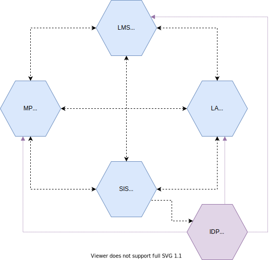
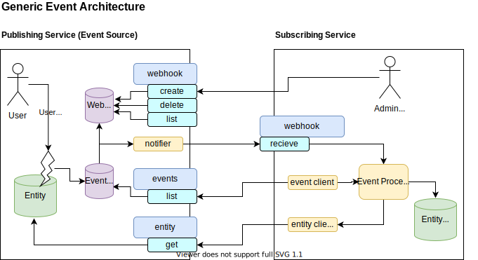

# Beginner's Guide

The beginner's guide gives you a high level overview of the scope and working of the SEM Ecosystem standard. This guide consists of the following paragraphs:
1. [Four servivces in the SEM Ecosystem](##1.-four-services-in-the-sem-ecosystem)
2. [Actors in the SEM Ecosystem](##2.-actors-in-the-sem-ecosystem)
3. [Webhooks and events](##3.-webhooks-and-events)
4. [Setup and consent](##4.-setup-and-consent)
5. [Principles](##5.-principles)
6. [Join the SEM Foundation and adopt the SEM Ecosystem standard](##6.-join-sem-foundation-and-adopt-the-sem-ecosystem-standard)

## 1. Four services in the SEM Ecosystem

Services are provided to enable the roles to carrying out the processes. The services communicate directly with each other, under the direction and control of the school (where appropriate). Note that schools can select multiple of these services, so multiple Learning Applications, multiple Learning Management Systems, multiple Marketplaces and even multiple School Information Systems. Next to that schools can also omit one or more of these services. In theory the smallest set might be a single Marketplace and a single Learning Application.

| Service | Description |
|---|---|
| [Marketplace (MP)](services/marketplace.md) | A service that allows buyers to order, and then have delivered, learning materials (physical and digital) via either a LML (for start school year) or at any time of the year either at school level or via students / parents.  A school can contract with multiple marketplaces if desired. |
| [Learning Management System (LMS)](services/learning-management-system.md) | A service that allows users to schedule and manage the learning material that is assigned to students.  The Learning Management system can be populated with learning material that is selected or purchased from a Marketplace. |
| [Learning Application (LA)](services/learning-application.md) | A service that allows for the delivery of a specific learning activity in a digital environment and subject.  This service is typically accessed via a Learning Management system but can also be accessed directly. |
| [School Information System (SIS)](services/school-information-system.md) | A service that allows an administrator to manage the core data that the school needs to operate:  students, teachers, subjects, streams and classes.  This data is then provided (at the minimum level required and under the control of the school) to other services to allow them to function efficiently.  The SIS is the source of the ECK-ID |
| [Identity Provider (IdP)](services/identity-provider.md) | A service that provides Identity information about both students and teachers to the other services in the ecosystem.  This includes the ECK-ID as base for other associated data as needed (e.g. the students initials or class information). The IdP is not shown in the above diagram and not equal to the SIS service |

Each of the API specifications here are connected to specific services:

The particular mapping of this specification is as follows:

| API Definition                                                                                                           | Service Provider | Services Consuming |
|--------------------------------------------------------------------------------------------------------------------------|------------------|--------------------|
| [Events](https://stichtingsem.stoplight.io/docs/sem-technology-prototype/reference/events.v1.yaml)                       | all              | all                |
| [Webhooks](https://stichtingsem.stoplight.io/docs/sem-technology-prototype/reference/events.v1.yaml)                     | all              | all                |
| [SIS Data](https://stichtingsem.stoplight.io/docs/sem-technology-prototype/reference/sisdata.v1.yaml)                    | SIS              | MP, LA, LMS        |
| [Catalogue Data](https://stichtingsem.stoplight.io/docs/sem-technology-prototype/reference/catalogue.v1.yaml)            | LA               | MP, LMS            |
| [Entitlements](https://stichtingsem.stoplight.io/docs/sem-technology-prototype/reference/entitlement.v1.yaml)            | MP               | LMS, LA            |
| [Usage](https://stichtingsem.stoplight.io/docs/sem-technology-prototype/reference/usage.v1.yaml)                         | LA               | MP, LMS            |
| [Progress & Results](https://stichtingsem.stoplight.io/docs/sem-technology-prototype/reference/progress-results.v1.yaml) | LA               | MP, LMS            |

## 2. Actors in the SEM Ecosystem

| Role | Example Types | Description |
|---|---|---|
| [User](roles/user.md) | Student Teacher   | An individual, or member of an organisation, who is a user of a service provided by participants in the eco-system, this may or may not be connected to a purchase having occurred previously (either pre or post pay). |
| [Buyer](roles/buyer.md) | Student (VO+) Teacher Parent LMC | An individual, or representative of an organisation who they are purchasing on behalf of, who is the buyer of Learning Material via a Marketplace. |
| [Administrator (SIS)](roles/administrator.md)| Administrator | An individual who is responsible for the maintenance of data stored within a SIS. |
| [LMC](roles/lmc.md) | Leermiddelen coordinator (Learning Materials Coordinator) | An individual responsible for collating the needs of the teachers across departments in a school, and creating the list of material (mandatory and optional) that is then ordered for the school for a given school year. |
| LML | Leermiddelen Lijst (Learning Material List) | A composed list of learning materials intended for a specific course, group, class |
| [Learning Materials Provider](roles/learning-materials-provider.md) | Publisher EdTech Company Teacher | An individual or organisation who provides learning materials for use both inside and outside the classroom, this can be either via folio or accessed via a digital Learning Application (provided either by the same company or a different one). |
| [Learning Management Provider](roles/learning-management-provider.md) | Publisher EdTech Company | An organisation that provides tools to schools to enable them to effectively manage scheduling of learning (typically this is referred to as an LMS or an ELO). |
| [LMS Provider](roles/lms-provider.md) | EdTech Company | An LMS provides capabilities for registering students in courses; documenting grading, transcripts, results of student tests and other assessment scores; building student schedules and tracking student attendance. This is the blend of the SIS Provider and the Learning Management Provider. |
| [Sales Agent](roles/sales-agent.md) | Distributor Retailer Publisher EdTech Company | An organisation that provides services for schools to order Learning Materials. |
| [Fulfilment Agent](roles/fulfilment-agent.md) | Distributor Publisher EdTech Company School | An organisation that takes responsibility for the fulfilment of Learning Material to an individual student or to a school, either through physical delivery or via delivery to the LMS in use within the school or directly to the individual (e.g. via email). Note a school can also provide material to its students. |
| [SIS Provider](roles/sis-provider.md) | EdTech Company | is a management information system for education establishments to manage student data. Student information systems provide capabilities for registering students in courses; documenting grading, transcripts, results of student tests and other assessment scores; building student schedules; tracking student attendance; and managing many other student-related data needs in a school This system is the source of the ECK-ID |

## 3. Webhooks and events

Explain the architectural model and the usage of webhooks and events.

A simple overview of a generic exchange is as follows, note that while this may look complex at first glance, it is a common pattern used in the B2B software space and is straight forward to implement on both sides of the exchange:

## 4. Setup and consent

Explains the setup and consent protocol 

## 5. Principles

#### 1. No mandatory central services, participants exchange information directly. Note data for a given school under the direct control of the school where appropriate
    - Simplified eco-system focused around the needs of a specific school and under their control
    - No central infrastructure that needs to be maintained and holds back all services based on its roadmap   
    - Simple entrance for new participants to any service 
    - Assumes high trust between participants through transparancy
    
#### 2. There can be multiple identity providers . We will use the ECK-ID to allow matching of students across them over time. Mechanisms are needed for schools and teachers	
    - Service providers (such as SIS vendors) are an ideal source of identity for schools, and can be relied upon within a schools ecosystem. Note a SIS is not equal to an IdP
    - Services such as those provided by Kennisnet can also be used, though are not strictly required
    
#### 3. Business model agnostic; can support pre-pay (transactional or subscription), freemium or usage based post-pay
    - While optimized for school start based on a LML, it can support other models
    - Flexibility for participants to offer products under any model they choose via any route they choose
    
#### 4. Based on a set of clear services that anyone can choose to provide to the ecosystem, and a single company may provide one or more services
    - No central control point that inhibits any single company (or small group) from controlling the ecosystem and stifling innovation
    - Freedom to compete in the provision of any service
    - Data is shared directly between services and can be cached for performance and reliability
    - Each service is responsible for its own redundancy and reliability
    
#### 5. Schools will be free to choose any services
    - Schools have the choice to use multiple providers for each service based on what suits their needs
    - Schools should be able to add / remove services during the school year
    
#### 6. Data will always be provided from the source, and not passed between services. It is always clear who is responsible for the data and that it is provided in a transparent way
    - Services can rely on data being correct and timely to avoid manual administration by schools
    - Innovation can happen on top of services that schools have already invested in
    - Data should be exchanged on “need to know basis”,  and binded to the purpose (goal binding/GDPR requirement or doelbinding/AVG eis)
    
#### 7. Data will be exchanged based on minimum required for delivery of services and data privacy

#### 8. Not have administration in the lead, always ensure access is possible
    - Ensure that users are always able to access material where they are entitled to.
    - No stock levels for digital products
    
#### 9. Need to be closed money goods flow
    - Usage of ‘goods’ means that money is/needs to be transferred to the one who is providing.

## 6. Join the SEM Foundation and adopt the SEM Ecosystem standard

All organisations offering products and/or services to Dutch schools are welcome to join the SEM Foundation and adopt the SEM Ecosystem standard. For more information about the implementation and the conformance certification read our [Implementation Guide](implementation-guide.md).