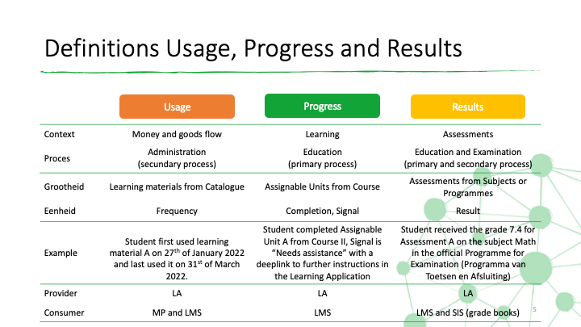

# Big Picture

The Big Picture gives you a high level overview of the scope and working of the SEM Ecosystem. This guide consists of the following paragraphs:
1. Four services in the SEM Ecosystem
2. Entitlements: right to activate and use a digital learning material from the catalogue of a Learning Application
3. Usage, progress, and results are crucial for transparency and insight
4. Core flow: Order and access of digital learning materials
5. Cancel, Block and Return flows
6. Setup and consent
7. Updates of data used in the Ecosystem (not yet documented)

## Four services in the SEM Ecosystem

Services are provided to enable the roles to carrying out the processes. The services communicate directly with each other, under the direction and control of the school (where appropriate). Note that schools can select multiple of these services, so multiple Learning Applications, multiple Learning Management Systems, multiple Marketplaces and even multiple Student Information Systems. Next to that schools can also omit one or more of these services. In theory the smallest set might be a single Marketplace and a single Learning Application.

| Service | Description |
|---|---|
| [Marketplace (MP)](documentation/services/marketplace.md) | A service that allows buyers to order, and then have delivered, learning materials (physical and digital) via either a LML (for start school year) or at any time of the year either at school level or via students / parents.  A school can contract with multiple marketplaces if desired. |
| [Learning Management System (LMS)](documentation/services/learning-management-system.md) | A service that allows users to schedule and manage the learning material that is assigned to students.  The Learning Management system can be populated with learning material that is selected or purchased from a Marketplace. |
| [Learning Application (LA)](documentation/services/learning-application.md) | A service that allows for the delivery of a specific learning activity in a digital environment and subject.  This service is typically accessed via a Learning Management system but can also be accessed directly. |
| [Student Information System (SIS)](documentation/services/school-information-system.md) | A service that allows an administrator to manage the core data that the school needs to operate:  students, teachers, subjects, streams and classes.  This data is then provided (at the minimum level required and under the control of the school) to other services to allow them to function efficiently.  The SIS is the source of the ECK-ID |

## Entitlements: right to activate and use a digital learning material from the catalogue of a Learning Application

The SEM Ecosystem is build upon the core concept of Entitlements. An Entitlement is the right to activate and use a digital learning material within an agreed upon period. Furthermore, an Entitlement is a clear, unambigious and transparent set of information required for all Parties in the Ecosystem to
- fulfil digital learning materials to the Buyer and its Entitlee(s);
- specify, administer, and control the financial transactions between the Buyer, the Market Place, and the Learning Application.

In the figure below we outlined the lifecycle of an Entitlement and its corresponding usage (or license) period.

The Market Place sells products from Learning Applications. The Learning Application publishes all their products in their Catalogue and allows a specific Market Place to sell a selection of these products to schools and/or individuals. For each digital learning material that is purchased at the Market Place, a new Entitlement is created with the status *Entitled*. This new Entitlement is send to the Learning Application and the Learning Management System. The Learning Application provisions the learning material to the Buyer. After provisioning, the Market Place changes the status of the Entitlement to *Provisioned*. This is the trigger for the Learning Management System to place the Access URLs on the learning lists of the students. After this link placement, the Market Place changes the status of the Entitlement to *LinkReady*. In the period between the start date and the ActivationUntilDate, entitlees related to the Buyer of the Entitlement are allowed to activate the digital learning material. After the ActivationUntilDate the status of the Entitlement changes to *Ended*. This is the final state of an Entitlement.

After a succesfull activation of a digital learning material, the usage or license period starts for the Entitlee. This changes the Entitlee into a Licensee. The Licensee is allowed to use the digital learning material until the agreed upon expirationDate. During this period the status of the license is *Activated*. After the expirationDate the status of the status of the license is changed to *Expired*. This is the final state of a licensee.

In addition to this normal lifecycle of both the Entitlement and the license, the Ecosystem has the following exception statuses:
- *Cancelled* Entitlement: not yet activated Entitlees cannot activate the digital learning material.
- *Blocked* Entitlement: Active Licensees are not allowed anymore to use the digital learning material and not yet activated Entitlees cannot activate the digital learning material.
- *Blocked* Licensee: The Active Licensee is not allowed anymore to use the digital learning material.

The Ecosystem supports four types of Entitlements. For each of these variants the order and access flow differs. This is further explained in the next paragraph.

| Variant | Name | Buyer | Description |
|---|---|---|---|
| A. | School | School | Learning materials bought for the entire school |
| B. | SchoolSubject | School | Learning materials bought for students that follow a specific SchoolSubject |
| C. | SchoolIndividual | School | Learning materials bought for specific individuals |
| D. | Personal | Individual | Learning materials bought for a single individual |

Within variant B, we introduce the SchoolSubject object. The SchoolSubject is a Subject (e.g. Math) on a school level (e.g. VWO) and within a learning year (e.g. learning year 3). The Entitlement variants offer Schools and Parties the possibility to choose the most applicable variant to their specific learning material and, its use case and the business model.

## Usage, progress, and results are crucial for transparency and insight

Within the SEM Ecosysten data is shared among Parties to give students, teachers, and schools more insight into the usage of digital learning materials. Moreover progress information and assessment results give insights into the learning journey of students. Each Learning Application has this information for the usage, progress, and results within their own products and related courses.

Within the Ecosystem Usage data is shared with the Market Place. This enables the Market Place and the Learning Application to offer digital learning materials with different business models. For example all-you-can-learn models or metered business models based on actual usage. Usage information is also shared with the Learning Management System. The Learning Management Sytem can provide an overall dashboard to Schools where they have an aggregated view on the activation and usage of digital learning materials bought at all their Market Place and from all the Learning Applications.

Progress information is shared with the Learning Management System. This allows the Learning Management System to provide learning dashboards towards Teachers and Students. A Teacher gets notified about the progress of students. Learning applications have the option to share a call to action signal alongside the progress itself. This call to action is a short description (e.g. Attention required) and a deeplink to further instructions within the Learning Application. This enables teachers and students to navigate from the Learning dashboard to the Learning Application and take follow-up actions. Within the Ecosystem we share progress information on the lowest level of the Course, being assignable units.

Assessment Results are reported to the grade books of the Learning Management System and/or the Student Information System. This includes the wide variety of Assessment variants including formative assessments, diagnostic tests, IQ tests, evaluative tests (volgsysteem) and more official summative assessments and exams. Within the Ecosystem we only share results for assessments, and not results on practice questions and assignments as part of the digital learning material.

## Core flow: Order and Access of digital learning materials (OA)

The SEM Ecosystem describes all required interactions between all Roles within the Ecosystem to sucessfully purchase and use digital learning materials within schools. The core flow is visualized in the figure below.

The figure shows all key activities of the seven main actors within the SEM Ecosystem: Buyer, User, Market Place, Learning Application, Student Information System, Learning Management System, and Identity Provider. Each main actor has its own swimming lane (as rows). The flow consists of five processes.

### [OA.1 School Order](documentation/use-cases/oa-1-school-order.md) and [OA.2 Individual Order](documentation/use-cases/oa-2-individual-order.md): the purchase of learning materials by a School or Individual as Buyer

The flow starts with a Buyer placing an order within the Market Place. This order can be a complete Learning Material List created within the Market Place or simply a shopping cart with learning materials. A Market Place can utilize Student and SchoolSubject information from the Student Information System and Catalogue Information from the Learning Applications to generate Learning Material Lists. The Ecosystem distinguishes between orders placed by Schools (OA.1) and Individuals (OA.2).

The purchased learning materials can include physical, digital, and combi products. The Market Place handles all activities related to this sale, including contracting, invoicing, and support. The sales order is split up by the Market Place into fulfilment orders per purchased product. All fulfilment orders with physical products are processed by the Market Place resulting in the delivery of the physical product to the Buyer at the agreed upon location. For delivery at the homes of Students, the Market Place can utilize the StudentDelivery information from the Student Information System. Fulfilment orders with digital products are fulfilled within the SEM Ecosystem using Entitlements. Fulfilment orders with combi products follow both routes: the physical components are delivered to the Buyer, the digital components are fulfilled within the SEM Ecosystem using Entitlements.

### OA.3 Digital Fulfilment: the fulfilment of digital learning materials using one of the four Entitlement variants

The fulfilment of digital learning materials consists of three activities:
- The Learning Application provisions the product to the Buyer and its User(s). After provisioning the Users are able to activate the digital learning material.
- The Learning Management System adds the product and optionally the course info to the generic library with learning materials of the School (School Library).
- The Learning Management System adds the product links to the learning lists of the users for which the product was purchased.

The Market Place is in charge of the digital fulfilment and triggers the above activities in sequence. For each of the Entitlement variants the digital fulfilment proces differs.

| Variant  | LA provisioning | LMS School Library | LMS Links |
|---|---|---|---|
| [A. School](documentation/use-cases/oa-3a-digital-fulfilment-school.md) | For all users from the school | Yes | School places the links manually or based on set rules within the LMS. |
| [B. SchoolSubject](documentation/use-cases/oa-3b-digital-fulfilment-schoolsubject.md) | For all users following specific SchoolSubject(s) | Yes | LMS adds the links automatically for all Students with one of the SchoolSubjects |
| [C. SchoolIndividual](documentation/use-cases/oa-3c-digital-fulfilment-schoolindividual-personal.md) | For all specified Individual(s) | Yes | LMS adds the links automatically for all Users for which the product was entitled. |
| [D. Personal](documentation/use-cases/oa-3c-digital-fulfilment-schoolindividual-personal.md) | For a specific Individual | No | LMS adds the links automatically for the User for which the product was entitled. |

### [OA.4 Initial Activation](documentation/use-cases/oa-4-initial-activation.md): the initial activation of a digital learning material by a User

After the start date, users are allowed to activate the digital learning material. A user logs in through [Kennisnet's Entree Federatie](https://www.kennisnet.nl/entree-federatie/) single sign-on service which federates the authentication of the user to the school's Identity Provider (IDP) through the use of SAML. The IDP has previously received the user's ECK iD from the school's SIS. Accompanied by other attributes (such as the user's name and school identification) the IDP sends the user's ECK iD in the SAML response to Entree, which in turn forwards it to the Learning Application. At the initial login of a new user, the Learning Application checks if the user is entitled to activate the product. For each of the Entitlement variants this check differs:

| Variant | Entitlement validation|
|---|---|
| A. School | Product is provisioned for School of User | 
| B. SchoolSubject | Product is provisioned for School of User and User follows the specified SchoolSubject (based on SIS data of User) |
| C. SchoolIndividual | Product is provisioned for School of User and User is on the Entitlee list of the Entitlement |
| D. Personal | User is the Entitlee of a Personal Entitlement |

After a succesful validation, the user is able to activate and immediately use the learning material. The Learning application registers the User as a new InitialActivation and Active Licensee of the Entitlement. The InitialActivation is send to the Market Place and optionally to the Learning Management System. The Market Place can use this information to trigger backoffice processes related to the Entitlement, e.g. update an activation dashboard, send a notification to the Buyer or initize post paid billing processes. The Learning Management System can use the information to update activation statistics of learning materials bought by Schools. Within the Learning Management Systems statistics of different Market Places of the School can be combined into a single dashboard. 

### [OA.5 Usage, Progress, and Results](documentation/use-cases/oa-5-usage-progress-results.md): the subsequent use of a digital learning material by a User resulting in Usage statistics, Progress information, and Results

The final process within the order and access flow is the subsequent use of the digital learnign material by the user. This results into usage statistics, Progress information, and Results. Usage statistics are send to the Market Place and optionally the LMS. The Market Place can use this information to trigger backoffice processes related to the Entitlement. Especially for business models based on usage this Usage information is critical for billing. The Learning Management System can aggregate all usage statistics into a single dashboard for schools to show how actively digital learning materials are used by users.

After starting and completing elements from the digital learning material, progress information is created for a Student. This information is shared with the Learning Management System to create dashboards for Teachers showing how far students are within the Course. After completing an assessment, Results can be send to the grade books within the Learning Management System and/or the Student Information System.

## Cancel, Block and Return flows
Within the Ecoystem, Entitlements specify the digital learning materials bought by the school. The previous paragraph described the **Happy** flow from order to activation and usage. In practice an order of a digital learning material can be cancelled within the cancellation period, a combi product could be returned or a Market Place wants to block access to a learning material. The Ecosystem supports these **Non-happy** flows with four Use Cases:

| Non-happy flow | Status change | Scenario |
|---|---|---|
| [CBR.1 Cancel Entitlement](documentation/use-cases/cbr-1-cancel-entitlement.md) | Entitlement to Cancelled | Buyer cancels an order during the allowed cancellation period |
| [CBR.2 Update Amount Entitlement](documentation/use-cases/cbr-2-update-amount-entitlement.md) | No status change, Amount changes | Buyer returns a combi product within the return period or school lowers the amount of a School or SchoolSubject Entitlement during the allowed cancellation period |
| [CBR.3 Block Entitlement](documentation/use-cases/cbr-3-block-entitlement.md) | Entitlement to Blocked | MP wants to cancel an Entitlement and prevent further access for already activated Licensees |
| [CBR.4 Change Licensee Status](documentation/use-cases/cbr-4-change-licensee-status.md) | Licensee to Blocked or Activated | MP wants to prevent further access or restore access for a single Licensee |

## Setup and consent

Data is only exchanged within the Ecosystem after a succesful setup and for some relationships after consent from the school.

### Setup of (market) Parties that want to join the Ecosystem in one or more roles (S)

These parties need to establish connections with all other parties in the ecosystem. In order to establish this connection, the new Party has to receive all endpoints and credentials from the other Parties. These bilateral authorizations require an acknowledgement from admins of both Parties. For more information see the implementation guides for implementing the [Student Information System](documentation/implementation-guide-SIS.md), [Learning Management System](documentation/implementation-guide-LMS.md), [Market Place](documentation/implementation-guide-MP.md) and/or [Learning Application](documentation/implementation-guide-LA.md) role(s).

### [Consent](documentation/use-cases/c-1-consentflow.md) for exchange of data between Parties within the Ecosystem of a School (C)

The school needs to acknowledge the data exchange between roles within the Ecosystem of the School. After the acknowledged consent the roles are allowed to exchange data acquired for their specific role. The Administrator of the school has to acknowledge this consent for each bilateral relation within the Ecosystem and at both sides of the relation (sender and receiver). Within the Ecosystemn Consent is given for the exchange of:

- SIS data from Student Information System with the Market Place, Learning Application, and/or Learning Management System
- Entitlement data from the Market Place with the Learning Managemnt System
- Usage, Progress, and Results data from Learning Application with the Learning Management System
- Results data from Learning Application with the Student Information System

For the exchange of data between Market Place and Learning Application no consent from the school is required. For more information about the way Consent is handled within the Ecosystem see Use Case [C.1 Consent flow](documentation/use-cases/c-1-consentflow.md).

## Mutations of data used in the Ecosystem (U)

Each Party in the Ecosystem is responsible for the integrity of data exchanged within their own APIs. For example the Student Information System is responsible for the integrity of all student data. Whenever data changes at the source, the providing role shares these updates with all other Parties that are subscribed to its API. We foresee changes on the following data objects:

| Object | New | Update | Delete | Status/Version Change | API | Providing Party | Consuming Party | Comment |
|---|---|---|---|---|---|---|---|---|
| Entitlement | - | - | - | - | Entitlement API | MP | LA, LMS | Mutations on Entitlements are not allowed. Changes require one of the four non-happy flows as stated above |
| Usage | X | X | - | - | Usage API | LA | MP, LMS | The Usage API is a reporting API. Only changes to Usage information are broadcasted. All other information (status and amounts) is only available via the GET endpoints |
| Student | X | X | X | - | SIS | SIS | MP, LMS, LA | |
| StudentDelivery | X | X | X | - | SIS API | SIS | MP | |
| SchoolSubject | - | - | - | - | SIS API | SIS | MP, LMS, LA | SchoolSubjects are included as an attribute of the Student information object |
| Teacher | X | X | X | - | SIS | SIS API | MP, LMS, LA | |
| Product | X | X | X | X | Catalogue API | LA | MP, LMS | |
| Course | X | X | X | X (version) | Course API | LA | LMS | |
| SimpleProgress | - | X | X | X | Progress API | LA | LMS | To be specified |
| SimpleResult | - | X | X | X | Results API | LA | LMS, SIS | To be specified |

The table above specficies all allowed mutations of data objects in the Ecosystem. For these mutations we work with the following set of general regulations and API specific regulations.

### General regulations for mutating data

The Ecosystem uses Events to communicate changes in data from the providing party to the consuming parties. These events are triggered immediately after the change is processed by the providing party. This allows all consuming parties to also change the information in their own systems and keep the data in sync. In this mutation process we work according to the following general agreements:

- If data of a data object changes, immediately thereafter an event is triggered by the producing party to all consuming parties that have consent to receive the (changed) data.
- All Events have a unique id, type, timestamp, and an optional url that can be called to get the data object for the event.
- The new data object is included in the Event with the final state of all its attributes.
- In case of the deletion of a data object the boolean isDeleteEvent is set to True.
- Information objects in the Ecosystem include unique identifiers. These identifiers are all globally unique identifiers and are not allowed to change.

### Entitlement API specific regulations

Entitlements specify transactional information about Learning Application's products sold by the Market Place. For audit and compliance reasons the Entitlement data object is not allowed to change. The only exceptions are the four Non-happy Cancel, Block, and Return flows as specified above.

### Usage API specific regulations

The Usage API can be seen as a reporting API for the Learning Application, Market Place and the Learning Management System. Within the API the GetEntitlementUsage and GetIndividualUsage endpoints give insight in the status, amount, and usage information about a specific entitlement of individual as registered by the Learning Application. This is especially useful in customer support or administrative processes. We agreed upon the following regulations:

- The Usage API sends events about actual usage of the product by a Licensee.
- After activating a product for an Entitlee, an InitialActivation event is send for this new Licensee for this product and Entitlement.
- Based on bilateral agreements further usage data is exchanged with the Market Place and or Learning Management System. For example in case of a monthly subscription, the monthly active usage data can be exchanged.
- Updates of the status of an Entitlement, the total amount provisioned for an Entitlement or the status of a Licensee are not exchanged within the Usage API. This information is already exchanged within the Entitlement API as described in the Cancel, Block, and return flows. Exchanging these changes within the Usage API would lead to duplicate information flows and as consequence noise or misinterpretation by the parties in the Ecosystem. As stated above, the Usage API does include these status and amount information in the getEntitlementUsage and getIndividualUsage endpoints for support and administration processes.

### SIS API specific regulations

Up to date information about Students (including StudentDelivery and SchoolSubjects) and Teachers is crucial for the correct functioning of the data exchanges within the Ecosystem. In almost all data objects a reference is made to a student and/or teacher. We therefore agreed upon the following regulations:

- For a Student and Teacher the attributes school (including schoolId and schoolName) and SchoolPeriod are not allowed to change.
- This implies that for the next schoolperiod all Students and Teachers are send again with their new SchoolPeriod value. This is for example the case by the start of the schoolyear.

Every Student has an array of SchoolSubjects that specifies all SchoolSubjects that a specific Student follows during the given SchoolPeriod. This data is crucial for the Entitlement variant SchoolSubject. The data is used to grant access to Entitlees that follow the specified SchoolSubject(s). For this reason we added the following regulations regarding new or updated SchoolSubject information for Students:

- In the event of a new Student, the LMS checks if the School has purchased learning materials for the SchoolSubjects this new Student follows. If this is the case, the links (access urls) are added to the Learning Material List of this Student.
- In the event a Student follows a new SchoolSubject (New SchoolSubject is added to the array of SchoolSubjects of this Student), the LMS checks if the School has purchased learning materials for this specific SchoolSubject. If this is the case, the links (access urls) are added to the Learning Material List of this student.
- In the event a Student stops following a SchoolSubject (SchoolSubject is removed from the array of SchoolSubjects of this Student), the LMS checks if the School has purchased learning materials for this specific SchoolSubject. If this is the case, the LMS removes the links (access urls) for all learning materials that are not activated yet by the Student. If the Student did activate the product, the Student is still allowed to use the product. The Ecosystem does not prescribe any further action by the LMS. A possible implementation could be to archive the link for this student, as the product is not relevant for the student anymore.
- To preserve the integrity of SchoolSubjects in the Ecosystem, the values subjectCode, level, and levelYear of SchoolSubjects are not allowed to change.

### Catalogue API specific regulations

The Catalogue API specifies all products of a Learning Application that are for sale. It is crucial that the integrity of this data is consistent and unchanged. After the product is sold to the customer, the product and its conditions are not allowed to change anymore. For this reason we added the following specific regulations for Product data:

- Type, Business Models, and the reference to the Course API are not allowed to change. The only exception being error corrections, in all other cases a new Product is added to the Catalogue.
- Based on the status of the product, the date attributes are required to fill and are (not) allowed to change. The dates have the following definitions:
	- FirstPublishedDate: Date the product came to market.
	- DepreciationDate: Date the LA communication that a the product will be replaced by a follow-up version
	- SupportedUntilate: Final date the product can be sold by a Market Place.
	- EndOfLifeDate: Final date the product can be fulfilled by a Market Place.

| Status | Description | Follow-up status | FirstPublishedDate | DepreciationDate | SupportedUntilDate | EndOfLifeDate |
|---|---|---|---|---|---|---|
| not-yet-available | Product can be sold, but cannot be fulfilled yet. | available, will-never-be-available, limited-avialable | Required Date is in the future Updates allowed | - | - | - |
| available | Product can be sold and used. | limited-available, temporary-not-available, no-longer-available |Required Date in the past Updates not allowed | Optional Date in the future Updates allowed | Optional Date in the future Updates allowed | Optional Date in the future Updates allowed |
| limited-available | Product can be sold, but physical stock is low and finite. | available, no-longer-available |Required Date in the past Updates not allowed | Required Date in the past Updates not allowed Date the product changed to status limited-available | Required Date in the future Updates allowed | Required Date in the future Updates allowed |
| temporary-not-available | Product can be sold, but until further notice not fulfilled. | available, no-longer-available | Required Date in the past Updates not allowed | Optional Date in the future Updates allowed | Optional Date in the future Updates allowed | Optional Date in the future Updates allowed |
| no-longer-available | Product cannot be sold anymore. Only activated Licensees are able to use the product. | not-available-or-usable| Required Date in the past Updates not allowed | Optional Date in the past Updates not allowed | Optional Date in the past Updates not allowed | Required Date in the past Updates not allowed |
| not-available-or-usable | Product cannot be sold anymore and all Licenses are expired. Support also ended. | n.a. | Required Date in the past Updates not allowed | Optional Date in the past Updates not allowed | Optional Date in the past Updates not allowed | Required Date in the past Updates not allowed |
| will-never-be-available | Product will never come to market. | n.a. | Optional Updates not allowed | Optional Updates not allowed | Optional Updates not allowed | Optional Updates not allowed |

### Course API specific regulations

The Course API specifies all units within a learning material. For this API we specified the following specific regulations:
- During the school year it is not desirable to change this information, as students are following these units. In practice, learning applications publish new content during the schoolyear (extend the Course with new blocks or units).
- The changes in the Course should not lead to a different product. As explained under the Catalogue API, customers bought a specific product with a reference to underlying Course content. To ensure the integrity of this product, the Course definition and content should not vary for customers that bought and/or use the product.
- Every change in the Course is reported including an update of the PublicationDate and the Version attributes.

### Progress and Results API specific regulations

There are no additional regulations for the progress and results API specified yet.
