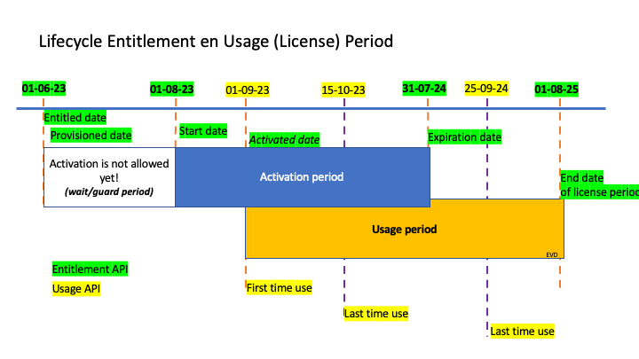
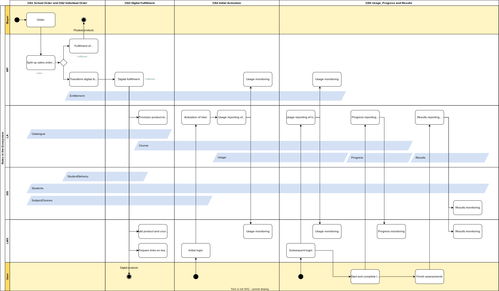

# Big Picture

The Big Picture eginner's guide gives you a high level overview of the scope and working of the SEM Ecosystem. This guide consists of the following paragraphs:
1. Four servivces in the SEM Ecosystem
2. Entitlements: the core concept within the SEM Ecosystem
3. Core flow: Order and access of digital learning materials
4. Setup and consent
5. Updates and mutations

## Four services in the SEM Ecosystem

Services are provided to enable the roles to carrying out the processes. The services communicate directly with each other, under the direction and control of the school (where appropriate). Note that schools can select multiple of these services, so multiple Learning Applications, multiple Learning Management Systems, multiple Marketplaces and even multiple School Information Systems. Next to that schools can also omit one or more of these services. In theory the smallest set might be a single Marketplace and a single Learning Application.

| Service | Description |
|---|---|
| [Marketplace (MP)](documentation/services/marketplace.md) | A service that allows buyers to order, and then have delivered, learning materials (physical and digital) via either a LML (for start school year) or at any time of the year either at school level or via students / parents.  A school can contract with multiple marketplaces if desired. |
| [Learning Management System (LMS)](documentation/services/learning-management-system.md) | A service that allows users to schedule and manage the learning material that is assigned to students.  The Learning Management system can be populated with learning material that is selected or purchased from a Marketplace. |
| [Learning Application (LA)](documentation/services/learning-application.md) | A service that allows for the delivery of a specific learning activity in a digital environment and subject.  This service is typically accessed via a Learning Management system but can also be accessed directly. |
| [School Information System (SIS)](documentation/services/school-information-system.md) | A service that allows an administrator to manage the core data that the school needs to operate:  students, teachers, subjects, streams and classes.  This data is then provided (at the minimum level required and under the control of the school) to other services to allow them to function efficiently.  The SIS is the source of the ECK-ID |
| [Identity Provider (IdP)](documentation/services/identity-provider.md) | A service that provides Identity information about both students and teachers to the other services in the ecosystem.  This includes the ECK-ID as base for other associated data as needed (e.g. the students initials or class information). The IdP is not shown in the above diagram and not equal to the SIS service |

## Entitlements: the core concept within the SEM Ecosystem
The SEM Ecosystem is build upon the core concept of Entitlements. An Entitlement is the right to activate a digital learning material within an agreed upon period. Furthermore, an Entitlement is a clear, unambigious and transparent set of information required for all Parties in the Ecosystem to
- fulfil digital learning materials to the Buyer and its User(s);
- specify, administer, and control the financial transactions between the Buyer, the Market Place, and the Learning Application.

In the figure below we outlined the lifecycle of an Entitlement and its corresponding usage (or license) period.

For each digital learning material that is purchased at the Market Place a new Entitlement is created with the status *Entitled*. This new Entitlement is send to the Learning Application. The Learning Application provisions the learning material to the Buyer. After provisioning, the Market Place changes the status of the Entitlement to *Provisioned*. In the period between the start date and the expiration date, users related to the Buyer of a Provisioned Entitlement are allowed to activate the digital learning material. After the experiation date the status of the Entitlement changes to *Expired*. This is the final state of an Entitlement.

After a succesfull activation of a digital learning material, the usage or license period starts for the User. The User is allowed to use the digital learning material until the agreed upon end date. During this period the status of the user is *Active*. After the end date the status of the status of the License is changed to *Ended*. This is the final state of a License.

In addition to this normal lifecycle of both the Entitlement and the License, the Ecosystem has the following exception statuses:
- *Blocked* Entitlement: Active Users are not allowed anymore to use the digital learning material and not yet activated users cannot activate the digital learning material.
- *Blocked* User: The Active User is not allowed anymore to use the digital learning material.

## Core flow: Order and Access of digital learning materials (OA)

The SEM Ecosystem describes all required interactions between all Roles within the Ecosystem to sucessfully purchase and use digital learning materials within schools. The core flow is visualized in the figure below.

The figure shows all key activities of the six main actors within the SEM Ecosystem: Buyer, User, Market Place, Learning Application, Student Information System, and Learning Management System. Each main actor has its own swimming lane (as rows). The flow consists of five processes.

### [OA.1 School Order](documentation/use-cases/oa-1-school-order.md) and [OA.2 Individual Order](documentation/use-cases/oa-2-individual-order.md): the purchase of learning materials by a School or Individual as Buyer

The flow starts with a Buyer placing an order within the Market Place. This order can be a complete Learning Material List created within the Market Place or simply a shopping cart with learning materials. A Market Place can utilize Student and SchoolSubject information from the Student Information System and Catalogue Information from the Learning Applications to generate Learning Material Lists. The Ecosystem distinguishes between orders placed by Schools (OA.1) and Individuals (OA.2).

The purchased learning materials can include physical, digital, and combi products. The Market Place handles all activities related to this sale, including contracting, invoicing, and support. The sales order is split up by the Market Place into fulfilment orders per purchased product. All fulfilment orders with physical products are processed by the Market Place resulting in the delivery of the physical product to the Buyer at the agreed upon location. For delivery at the homes of Students, the Market Place can utilize the StudentDelivery information from the Student Information System. Fulfilment orders with digital products are fulfilled within the SEM Ecosystem using Entitlements. Fulfilment orders with combi products follow both routes: the physical components are delivered to the Buyer, the digital components are fulfilled within the SEM Ecosystem using Entitlements.

### OA.3 Digital Fulfilment: the fulfilment of digital learning materials using one of the four Entitlement variants

The fulfilment of digital learning materials consists of three activities:
- The Learning Application provisions the product to the Buyer and its User(s). After provisioning the Users are able to activate the digital learning material.
- The Learning Management System adds the product and optionally the course info to the generic library with learning materials of the School (School Library).
- The Learning Management System adds the product links to the learning lists of the users for which the product was purchased.

The Market Place is in charge of the digital fulfilment and triggers the above activities in sequence. Within the SEM Ecosystem we support four variants of Entitlements: School, SchoolSubject, Individual and Personal. For each of these variants the digital fulfilment proces is different.

| Variant | Buyer | LA provisioning | LMS School Library | LMS Links |
|---|---|---|---|---|
| [A. School](documentation/use-cases/oa-3a-digital-fulfilment-school.md) | School | For all users from the school | Yes | School places the links manually or based on set rules within the LMS. |
| [B. SchoolSubject](documentation/use-cases/oa-3b-digital-fulfilment-schoolsubject.md) | School | For all users following specific SchoolSubject(s) | Yes | LMS adds the links automatically for all Students with one of the SchoolSubjects |
| [C. SchoolIndividual](documentation/use-cases/oa-3c-digital-fulfilment-schoolindividual-personal.md) | School | For all specified Individual(s) | Yes | LMS adds the links automatically for all Users for which the product was entitled. |
| [D. Personal](documentation/use-cases/oa-3c-digital-fulfilment-schoolindividual-personal.md) | Individual | For a specific Individual | No | LMS adds the links automatically for the User for which the product was entitled. |

Within variant B. SchoolSubject, we introduce the SchoolSubject object. The SchoolSubject is a Subject (e.g. Math) on a school level (e.g. VWO) and within a learning year (e.g. learning year 3). The Entitlement variants offer Schools and Parties the possibility to choose the most applicable variant to their specific learning material and use case. For example:

- Learning materials that are offered as an all-you-can-eat model at school level can use variant A. School. All students from the school are allowed to activate the learning material.
- Learning materials that are made for a specific subject and a specific school level could benefit from variant B. SchoolSubject. At the moment of purchasing the School does not have to specifically know all students yet. But the school does know that only students that follow the SchoolSubject are allowed to activate the learning material. And all the students that follow the SchoolSubject have the links on their learning lists. 
- Finally the SchoolIndividual variant is the most strict variant. A school knows that only the individual for which the learning material was bought is able to activate the learning material and has the link on their learning list.

### [OA.4 Initial Activation](documentation/use-cases/oa-4-initial-activation.md): the initial activation of a digital learning material by a User

After the start date, users are allowed to activate the digital learning material. At the initial login of a new user, the Learning Application checks if the user is entitled to activate the product. For each of the Entitlement variants this check is different:

| Variant | Entitlement validation|
|---|---|
| A. School | Product is provisioned for School of User | 
| B. SchoolSubject | Product is provisioned for School of User and User follows the specified SchoolSubject (based on SIS data of User) |
| C. SchoolIndividual | Product is provisioned for School of User and User is on the Entitlee list of the Entitlement |
| D. Personal | Personal Entitlement for User |

After a succesful validation, the user is able to activate and immediately use the learning material. The Learning application registers the User as a new InitialActivation and Active Licensee of the Entitlement. The InitialActivation is send to the Market Place and optionally to the Learning Management System. The Market Place can use this information to trigger backoffice processes related to the Entitlement, e.g. update an activation dashboard, send a notification to the Buyer or initize post paid billing processes. The Learning Management System can use the information to update activation statistics of learning materials bought by Schools. Within the Learning Management Systems statistics of different Market Places of the School can be combined into a single dashboard. 

### [OA.5 Usage, Progress, and Results](documentation/use-cases/oa-5-usage-progress-results.md): the subsequent use of a digital learning material by a User resulting in Usage statistics, Progress information, and Results

The final process within the order and access flow is the subsequent use of the digital learnign material by the user. This results into usage statistics, Progress information, and Results. Usage statistics are send to the Market Place and optionally the LMS. The Market Place can use this information to trigger backoffice processes related to the Entitlement. Especially for business models based on usage this Usage information is critical for billing. The Learning Management System can aggregate all usage statistics into a single dashboard for schools to show how actively digital learning materials are used by users.

After starting and completing elements from the digital learning material, progress information is created for a Student. This information is shared with the Learning Management System to create dashboards for Teachers showing how far students are within the Course. After completing an assessment, Results can be send to the grade books within the Learning Management System and/or the Student Information System.

## Setup and consent

### Setup of (market) Parties that want to join the Ecosystem in one or more roles (S)

These parties need to establish connections with all other parties in the ecosystem. In order to establish this connection, the new Party has to receive all endpoints and credentials from the other Parties. These bilateral authorizations require an acknowledgement from admins of both Parties.

- TODO: [S.1 Connect a new Party into the Ecosystem]
- TODO: [S.2 Setup of Market Place for a new Learning Application (Catalogue)](documentation/use-cases/s.1.0-learning-application-sales-agent.md)
- TODO: [S.3 Setup of Learning Management System for a new Learning Application (Catalogue and Course)]

### Consent for exchange of data between Parties within the Ecosystem of a School (C)

The school needs to acknowledge the data exchange between roles within the Ecosystem of the School. After the acknowledged consent the roles are allowed to exchange data acquired for their specific role. The Administrator of the school has to acknowledge this consent for each bilateral relation within the Ecosystem and at both sides of the relation (sender and receiver).

- TODO: [C.1 Consent for the exchange of SIS data from Student Information System with the Market Place, Learning Application, and/or Learning Management System]
- TODO: [C.2 Consent for the exchange of Entitlement data from the Market Place with the Learning Managemnt System]
- TODO: [C.3 Consent for the exchange of Usage, Progress, and Results data from Learning Application with the Learning Management System]
- TODO: [C.4 Consent for the exchange of Results data from Learning Application with the Student Information System]
- TODO: [C.5 Revoke consent for the exchange of data from a Party]

For the exchange of data between Market Place and Learning Application no consent from the school is required. 

## Updates of data objects within the Ecosystem (U)

Each Party in the Ecosystem is responsible for the integrity of data exchanged within their own APIs. For example the Student Information System is responsible for the integrity of all student data. Whenever data changes at the source, the providing role shares these updates with all other Parties that are subscribed to its API. We foresee changes on the following data objects:

| Object | New | Update | Delete | Status Change | API | Providing Party | Consuming Party |
|---|---|---|---|---|---|---|---|
| Student | X | X | X | - | SIS | SIS | MP, LMS, LA |
| StudentDelivery | X | X | X | - | SIS API | SIS | MP |
| Teacher | X | X | X | - | SIS | SIS API | MP, LMS, LA |
| SchoolSubject | X | X | X | - | SIS API | SIS | MP, LMS, LA |
| Product | X | X | X | X | Catalogue API | LA | MP, LMS |
| Course | X | X | X | X | Course API | LA | LMS |
| Entitlement | - | X | - | X | Entitlement API | MP | LA, LMS |
| LicenseUsage | - | X | - | - | Usage API | LA | MP, LMS |
| SimpleProgressStatement | - | X | X | X | Progress API | LA | LMS |
| Result | - | X | X | - | Results API | LA | LMS, SIS |

For each of the mutations shown in the above table we have to specify the expected behavior of the receiving Party in a detailed flow. As we work through any pilot and implementation we will specify and expand these mutation processes.