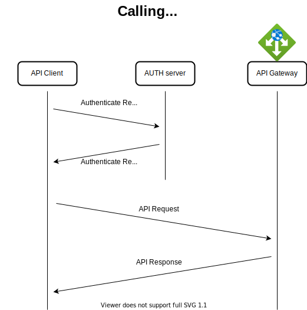

# Authentication in the API's
> Note: there is discussion how we can support NL Edukoppeling for SaaS Vendor https://github.com/stichtingsem/ecosystem/issues/9

## Authentication
For authentication of API calls we will initially use auth2 tokens in the rest calls.

So before calling the API, the API client needs to call the authentication server to get a authentication token to do the request. The token will contain the identity of the party calling the API, one or more scope's (see [scopes](##authorization-&-Scope)) 

This is an industry standard (See https://oauth.net/2/) and is supported by many software languages and frameworks.

For more details: see [API-authentication-token](API-authentication-token.md)

Each party will implement its own AUTH Server and publish the url of the token endpoint
# School identity
Many calls are made on behalf of the school (after consent). The school will be incuded as claim in the oauth token.

For each call the api endpoint knows which party did the call and on behalf of which school

For more details: see [API-authentication-token](API-authentication-token.md)

# Authorization & Scopes
Each API documentation describes what scope is needed in the authentication token. These are described in the [API reference](//reference/README.md)

example of scopes : 
| scope | purpose |
|--|--|
sis.student-teacher-group | Access to basic student, teacher and group information.
sis.student-teacher-delivery |Access to sensitive student and teacher delivery information.
la.catalogue | Access to the basic provider catalogue
la.course.school | Access to available course information available to a school
la.results.school | Access to progress and results for a specific learner at a specific school'
mp.entitlement.active | First created and active
mp.entitlement.refunded | Refunded
mp.entitlement.updated | Modified in any other way
la.usage.first | First time usage of a entitlement for a specific student
la.usage.ongoing | Ongoing  usage of a entitlement for a specific student

