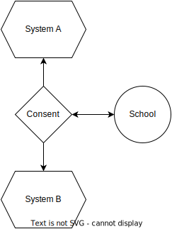
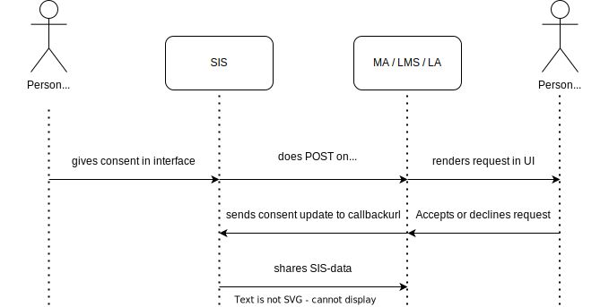
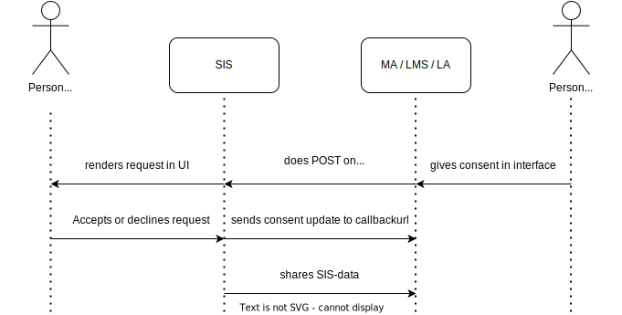
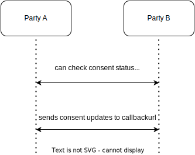

# Consent flow

__Introduction__
    
One of the core principals of SEM is that the school should be in charge of deciding who can access their data. The data is therefor only shared when a person with certain rights (for example: a privacy officer) has given consent to share data with 2 parties in de ecosystem. For example: a privacy officer gives consent in the SIS to share data with an MP, and gives consent in the MP to receive the SIS-data. Once the consent is given in both systems, the actual data is shared.

The school must give consent for the following data exchanges:
- SIS to MP, LMS & LA (SIS-data)
- MP to LMS (Entitlements)
- LA to LMS (Usage, Progress & Results)
- LA to SIS (Results)

To streamline this process we developed the consent-api. The core principal is when consent is given (or revoked), the other party is notified of this change. For this purpose an optional endpoint is available. For example: if consent is revoked in the SIS to share data with a MP, the MP receives notification that this happened.

Example scenarios: SIS to MP, LM & LA

The consent process can be started in either the SIS or the MP, LM or LA. When consent is given in the SIS, a consent update is sended to the other party. The received update needs to be made visible in the other system. A person with certain rights (in some cases the same person as in the SIS) can use this to give the consent from that system:

This process can also be turned around. Then the process starts in the MP, LM or LA. Important is that in all cases the consent is given on both sides and parties inform each other:

Other scenario's:

The same goes for the exchange of usage, progress & results from the LA to a LMS, for the sharing of results from the LA to a SIS, and for the sharing of entitlements from the MP. Consent can be started in either system, but consent needs to be given in both systems before data is shared. 

The user can also revoke a prior given consent. An updatemessage will than also be send to the consent endpoint. At all times a party can check the status of the consent in the other system. Status can be Active or Revoked.

