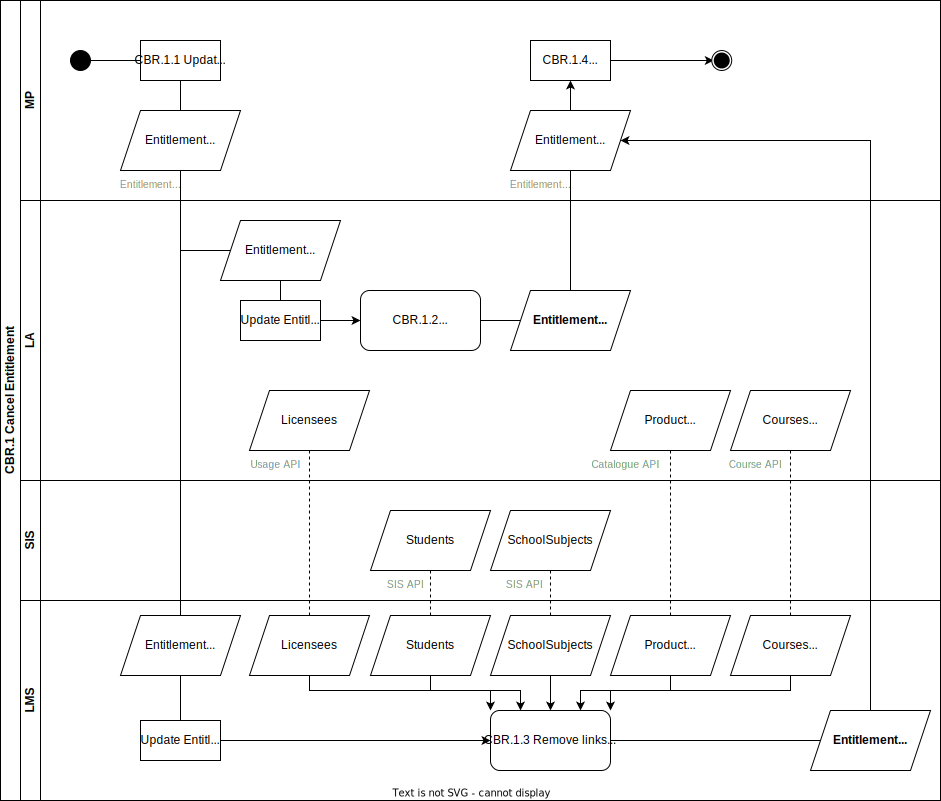

# CBR.1 Cancel Entitlement

In this non-happy flow a Buyer cancels an order for a combi or digital learning material with the Market Place. The Market Place wants to revoke the right to activate for the Entitlement.

## Roles Involved

  - [Buyer](../roles/buyer.md)
  - [LMC](../roles/lmc.md)
  - [Sales Agent](../roles/sales-agent.md)
  - [Fulfilmment Agent](../roles/fulfilment-agent.md)
  
## Services Involved

  - [Learning Management System](../services/learning-management-system.md)
  - [Learning Application](../services/learning-application.md)
  - [Market Place](../services/marketplace.md)

## Basic Flow of Events

| No. | Input | Data | Process | Output |
|---|---|---|---|---|
| CBR.1.1 | N.A. | N.A. | MP changes the changes the state of the Entitlement to Cancelled. | EntitlementEvent Cancelled. |
| CBR.1.2 | EntitlementEvent Cancelled | N.A. | Learning Application prevents that not yet activated Entitlees can activate the product. | EntitlementConfirmation Cancelled |
| CBR.1.3 | EntitlementEvent Cancelled | Licensees Students SchoolSubjects Product (Access URL) Courses (Course URLs) | Learning Management System removes all links for Entitlees that did not activate the product yet. Activated Licensees are still able to use the product. | EntitlementConfirmation Cancelled |
| CBR.1.4 | EntitlementConfirmation Cancelled (2x) | N.A. | Market Place receives EntitlementConfirmations form both the Learning Application and the Learning Management System. After these confirmations the Market Place can take further actions regarding the Cancellation of the order. | Process Cancellation in backoffice. Enddate of Entitlement is updated |

## Preconditions

  - Digital fulfilment of Entitlement is completed.
  - Status of Entitlement is LinkReady

## Post-conditions

  - Status of Entitlement is changed to Cancelled and endDate is updated with date of cancellation
  - Learning Application cancelled the provisioning of the product for Entitlees that did not activate the product yet
  - Learning Management System removed all links for Entitlees that did not activate the product yet
  - Licensees that activated the product before the cancellation are still able to use the product and also still have links on their learning lists in the Learning Management System