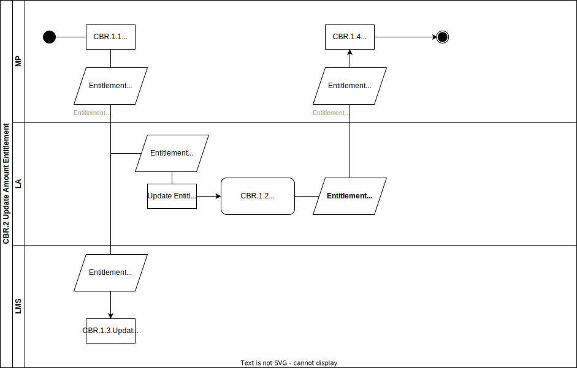

# CBR.2 Update amount entitlement

In this non-happy flow a Buyer partly cancels an order for a combi or digital learning material with the Market Place or the Market Place received a returned Combi product. The order was an open ended Entitlement Variant of School or SchoolSubject. SchoolIndividual or Personal Entitlements are Cancelled or Blocked. The Market Place has the ability to update the amount of the School or SchoolSubject entitlement. The new amount is shared with the Learning Application and the Learning Management System.

## Roles Involved

  - [Buyer](../roles/buyer.md)
  - [LMC](../roles/lmc.md)
  - [Sales Agent](../roles/sales-agent.md)
  - [Fulfilmment Agent](../roles/fulfilment-agent.md)
  
## Services Involved

  - [Learning Management System](../services/learning-management-system.md)
  - [Learning Application](../services/learning-application.md)
  - [Market Place](../services/marketplace.md)

## Basic Flow of Events

| No. | Input | Data | Process | Output |
|---|---|---|---|---|
| CBR.2.1 | N.A. | N.A. | MP updates the amount of an Entitlement after receiving a partly cancellation or a return of a combi product. | EntitlementEvent NewAmount. |
| CBR.2.2 | EntitlementEvent NewAmount | N.A. | Learning Application updates the Entitlement information with the newAmount. This information is for transparancy also registered in the Usage API | EntitlementConfirmation NewAmount NewAmount updated in Usage API for Entitlement |
| CBR.2.3 | EntitlementEvent NewAmount | N.A. | Learning Management System is not required to take any action and can update the Entitlement info in their own backoffice. This can be useful for Usage dashboards. | N.A. |
| CBR.2.4 | EntitlementConfirmation NewAmount | N.A. | Market Place receives EntitlementConfirmations form the Learning Application. After this confirmation the Market Place can take further actions regarding the lowering of the amount of the order. | Process newAmount in backoffice. |

## Preconditions

  - Digital fulfilment of Entitlement is completed.
  - Status of Entitlement is LinkReady
  - NewAmount is higher than total of Activated and Blocked Licensees of Entitlement
  - Entitlement is of type School or SchoolSubject

## Post-conditions

  - Amount of Entitlement is changed to newAmount
  - Learning Application updated the amount of the Entitlement to newAmount, and registered this newAmount in the Usage API
  - Learning Management System updated the amount of the Entitlement to newAmount
