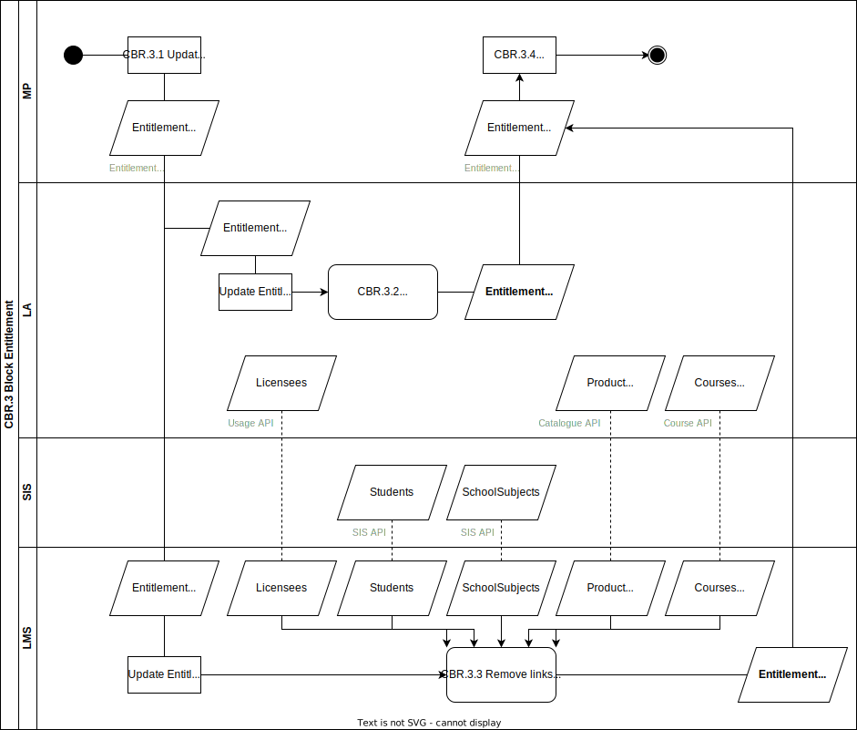

# CBR.3 Block Entitlement

In this non-happy flow the Market Place wants to revoke the right to activate for an Entitlement and also wants to prevent further access for Licensees that activated the product.

## Roles Involved

  - [Buyer](../roles/buyer.md)
  - [LMC](../roles/lmc.md)
  - [Sales Agent](../roles/sales-agent.md)
  - [Fulfilmment Agent](../roles/fulfilment-agent.md)
  
## Services Involved

  - [Learning Management System](../services/learning-management-system.md)
  - [Learning Application](../services/learning-application.md)
  - [Market Place](../services/marketplace.md)

## Basic Flow of Events

| No. | Input | Data | Process | Output |
|---|---|---|---|---|
| CBR.3.1 | N.A. | N.A. | MP changes the changes the state of the Entitlement to Blocked. | EntitlementEvent Blocked. |
| CBR.3.2 | EntitlementEvent Blocked | N.A. | Learning Application prevents that not yet activated Entitlees can activate the product and blocks access to all Licensees that activated the product | EntitlementConfirmation Blocked All Licensees status changed to BLocked |
| CBR.3.3 | EntitlementEvent Blocked | Licensees Students SchoolSubjects Product (Access URL) Courses (Course URLs) | Learning Management System removes all links for Entitlees and Licensees. | EntitlementConfirmation Blocked |
| CBR.3.4 | EntitlementConfirmation Blocked (2x) | N.A. | Market Place receives EntitlementConfirmations form both the Learning Application and the Learning Management System. After these confirmations the Market Place can take further actions regarding the Blocked Entitlement. | Process Blocked Entitlement in backoffice. Enddate of Entitlement is updated |

## Preconditions

  - Digital fulfilment of Entitlement is completed.
  - Status of Entitlement is LinkReady or Cancelled

## Post-conditions

  - Status of Entitlement is changed to Blocked and endDate is updated with date of Block
  - Learning Application cancelled the provisioning of the product for Entitlees that did not activate the product yet
  - Learning Application prevents further usage for Licensees that activated the product
  - Learning Application updated the status of all Licensees to Blocked
  - Learning Management System removed all links for Entitlees and Licensees