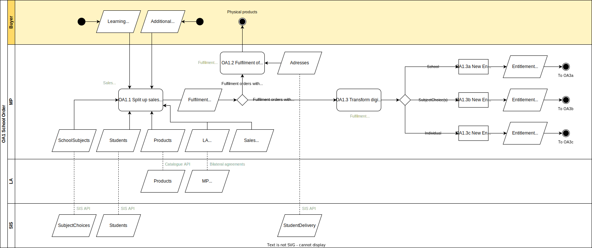

# OA.1 Purchase of learning materials by a School as Buyer

The process by which a [Buyer](../roles/buyer.md) places an order at the Market Place. In this process the Buyer is an employee from a school, e.g. the [Learning Materials Coordinator](../roles/lmc.md). The order can be a complete [Learning Material List](../glossary.md) or a shopping cart with (additional) learning materials. The iterative process of creating a LML is not part of the Ecosystem and can be performed in a separate application or within the Market Place.

## Roles Involved

  - [Buyer](../roles/buyer.md)
  - [LMC](../roles/lmc.md)
  - [Sales Agent](../roles/sales-agent.md)
  - [Fulfilmment Agent](../roles/fulfilment-agent.md)

## Services Involved

  - [Market Place](../services/marketplace.md)

## Basic Flow of Events

| No. | Input | Data | Process | Output |
|---|---|---|---|---|
| OA.1.1 | A Buyer from the School selects and orders the Learning Materials in the Market Place. The Buyer could order a complete Learning Material List or a shopping cart of (additional) learning materials. | Products from the Catalogue of the LA Students from the SIS SchoolSubjects from the SIS Sales contracts with the School   Contracts with the Learning Application | The Market Place in its role of Sales Agent processes the order and takes care of all contractual, administrative, and billing processes. Moreover the Sales order is split into fulfilment orders per product | Fulfilment orders per product that can be processed by the Market Place in its role Fulfilment Agent. |
| OA.1.2 | Fulfilment orders with physical and combi products. | StudentDelivery information for the delivery at home addresses of Students | The Market Place in its role of Fulfilment Agent processes all Fulfilment orders with physical products. All processes are triggered that are required to deliver the physical products. | The physical products are delivered at the agreed upon location and time. |
| OA.1.3 | Fulfilment orders with combi and digital products. | N.A. | The Market Place in its role of Fulfilment Agent processes all fulfilment orders with digital products. Based upon the agreed upon contract with the school one of three digital fulfilment variants is chosen for each fulfilment order. The fulfilment order is transformed into the respective Entitlement variant. | An Entitlement of the variant School, SchoolSubject or SchoolIndividual for the School, the purchased Product, and the ordered quantity. |

## Preconditions

  - The school has selected one or more Marketplaces to be a provider of learning materials and learning applications.
  - Setup between the Learning Applications and the Market Places [S.2]()
  - Setup between the Learning Applications and the Learning Management System [S.3]()
  - The school Administrator has given consent to the Market Place for the exchange of SIS data from the Student Information System [C.1]()
  - The school Administrator has given consent to the Learning Applications for the exchange of SIS data from the Student Information System [C.1]()
  - The school Administrator has given consent to the Learning Management System for exchange of SIS data from the Student Information System. [C.1]()
  - The school Administrator has given consent to the Learning Management System for the exchange of Entitlement data from the Market Place. [C.2]()
  - The school has a valid school_id used within the Ecosystem (digideliveryID in NL)

## Post-conditions

  - All phyisal products and all physical components from combi products that were ordered are delivered to the Buyer.
  - The Order from the Buyer is for each digital product, or digital component within a combi product transformed into one of the Entitlement Variants to be fulfilled in OA.3a, OA.3b, OA.3c.

## Next process

The flow continues for each entitlement with either OA.3a (School Entitlement), OA.3b (SchoolSubject Entitlement) or OA.3c (SchoolIndividual Entitlement).