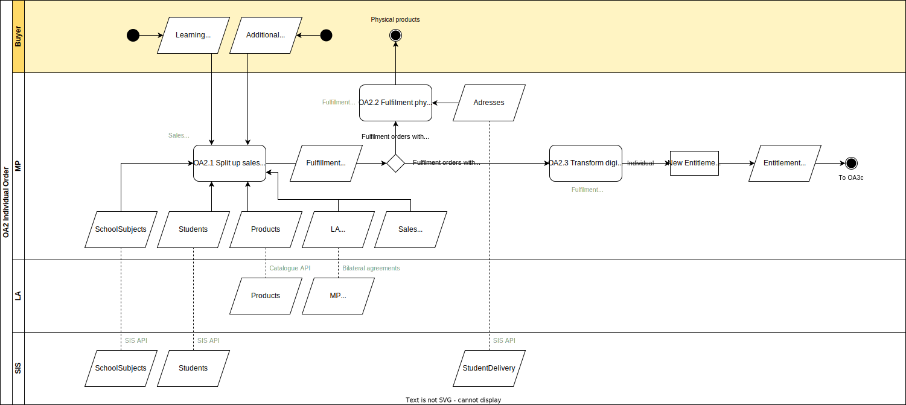

# OA.1 Purchase of learning materials by an Individual as Buyer

The process by which a [Buyer](../roles/buyer.md) places an order at the Market Place. In this process the Buyer is an individual, e.g. a Student or a Parent. The order is a shopping cart with learning materials.

## Roles Involved

  - [Buyer](../roles/buyer.md)
  - [Sales Agent](../roles/sales-agent.md)
  - [Fulfilmment Agent](../roles/fulfilment-agent.md)

## Services Involved

  - [Market Place](../services/marketplace.md)
  
## Basic Flow of Events

| No. | Input | Data | Process | Output |
|---|---|---|---|---|
| OA.2.1 | A Student (or Parent) orders Learning Materials in the Market Place. These Learning Materials could be the complete Learning Material List as prescribed by the school. Another possibility is the ordering of additional Learning Materials. | Products from the Catalogue of the LA Students from the SIS SchoolSubjects from the SIS Contracts with the Learning Application | The Market Place in its role of Sales Agent processes the order and takes care of all contractual, administrative, and billing processes. Moreover the Sales order is split into fulfilment orders per product | Fulfilment orders per product that can be processed by the Market Place in its role Fulfilment Agent. |
| OA.2.2 | Fulfilment orders with physical and combi products. | StudentDelivery information for the delivery at home addresses of Students | The Market Place in its role of Fulfilment Agent processes all Fulfilment orders with physical products. All processes are triggered that are required to deliver the physical products. | The physical products are delivered at the agreed upon location and time. |
| OA.2.3 | Fulfilment orders with combi and digital products. | N.A. | The Market Place in its role of Fulfilment Agent processes all fulfilment orders with digital products. All digital learning materials bought by individuals are fulfilled according to the Entitlement variant Personal.  | An Entitlement of the variant Personal for the Buyer and the purchased Product. |

## Preconditions

  - Setup between the Learning Applications and the Market Places [S.2.0]()
  - Setup between the Learning Applications and the Learning Management System [S.3.0]()
  - The school Administrator has given consent to the Market Place for the exchange of SIS data from the Student Information System [C.1.0]()
  - The school Administrator has given consent to the Learning Applications for the exchange of SIS data from the Student Information System [C.1.0]()
  - The school Administrator has given consent to the Learning Management System for exchange of SIS data from the Student Information System. [C.1.0]()
  - The school Administrator has given consent to the Learning Management System for the exchange of Entitlement data from the Market Place. [C.2.0]()

## Post-conditions

  - All phyisal products and all physical components from combi products that were ordered are delivered to the Buyer.
  - The Order from the Buyer is for each digital product, or digital component within a combi product, transformed into a Personal Entitlement.

## Next process

The flow continues for each Personal entitlement with OA.3c.