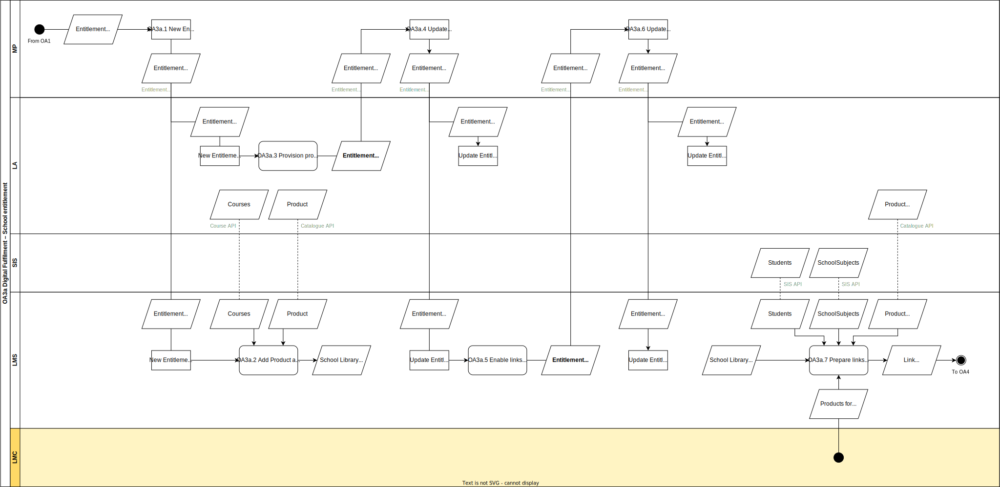

# OA.3a Digital fulfilment of School Entitlements

In this process a School Entitlement is fulfilled to the [Users](../roles/user.md) related to the [Buyer](../roles/buyer.md) of the digital learning materials.

## Roles Involved

  - [Fulfilmment Agent](../roles/fulfilment-agent.md)
  - [Learning Materials Provider](../roles/learning-materials-provider.md)
  - [Learning Management Provider](../roles/learning-management-provider.md)
  - [Learing Materials Coordinator](../roles/lmc.md)

## Services Involved

  - [Market Place](../services/marketplace.md)
  - [Learning Management System](../services/learning-management-system.md)
  - [Learning Application](../services/learning-application.md)

## Basic Flow of Events

| No. | Input | Data | Process | Output |
|---|---|---|---|---|
| OA.3a.1 | Entitlement School | N.A. | The Market Place in its role of Fulfilment agent triggers all digital fulfilment steps in sequence. | Send Entitlement to Learning Management System for adding of digital learning material to School Library Send Entitlement to Learning Application for provisioning digital learning material for school Send Provisioned Entitlement to Learning Management System for activating product links after start date |
| OA.3a.2 | Entitlement School | Product info from Catalogue  Course info from Course | The Learning Management System receives a new Entitlement from the Market Place. The digital learning material on this entitlement is added to the School Library of learning materials. This includes product links but also deeplinks to chapters and elements within the Course. | Digital Learning Material is available in the School Library Course links are available in the School Library All links are still disabled |
| OA.3a.3 | Entitlement School | N.A. | The Learning Application provisions the digital learning material for the school. All users from the school are allowed to activate the digital learning material after the start date. | Digital learning material is provisioned for the School A provisioning confirmation is send to the Market Place |
| OA.3a.4 | Provisioning confirmation | N.A. | The Market Place receives a provisioning confirmation from the Learning Application and changes the state of the Entitlement to Provisioned. | Entitlement state changed to Provisioned. |
| OA.3a.5 | Entitlement School Provisioned | N.A. | The Market Place shares the provisioned state of the Entitlement with the Learning Management System. | Entitlement School Provisioned |
| OA.3a.6 | Entitlement School Provisioned | N.A. | The Learning Management System receives the status Provisioned for an Entitlement from the Market Place. This means that all product and course links for the digital learning material from the Entitlement can be enabled after start date. | Product and course links are automatically enabled after start date. |
| OA.3a.7 | A Learning Material Coordinator or a Teacher wants to add product links to the learning lists of students | School Library Students SchoolSubjects | Within the Learning Management System the Learning Material Coordinator or a Teacher can add links to the learning material lists of students. This can be a manual process, but could also be based on setting rules within the LMS. | Product links on the learning material lists of Students |

## Preconditions

  - The School ordered a digital learning material in OA.1 resulting into an Entitlement of the variant School.

## Post-conditions

  - Product and course links of the entitled digital learning material are added to the School Library with digital learning materials
  - Digital learning material is provisioned to the school
  - Product links are available on the learning material list of students

## Next process

The flow continues with the initial activation of the digital learning material by a User (OA.4).