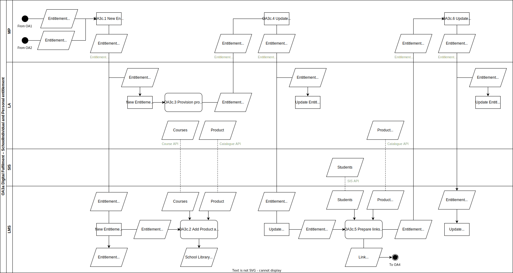

# OA.3c Digital fulfilment of SchoolIndividual or Personal Entitlements

In this process a SchoolIndividual or Personal Entitlement is fulfilled to the [User(s)](../roles/user.md) related to the [Buyer](../roles/buyer.md) of the digital learning materials.

## Roles Involved

  - [Fulfilmment Agent](../roles/fulfilment-agent.md)
  - [Learning Materials Provider](../roles/learning-materials-provider.md)
  - [Learning Management Provider](../roles/learning-management-provider.md)

## Services Involved

  - [Market Place](../services/marketplace.md)
  - [Learning Management System](../services/learning-management-system.md)
  - [Learning Application](../services/learning-application.md)

## Basic Flow of Events

| No. | Input | Data | Process | Output |
|---|---|---|---|---|
| OA.3c.1 | Entitlement SchoolIndividual Entitlement Personal | N.A. | The Market Place in its role of Fulfilment agent triggers all digital fulfilment steps in sequence. | Send Entitlement to Learning Management System for adding of digital learning material to School Library Send Entitlement to Learning Application for provisioning digital learning material for school Send Provisioned Entitlement to Learning Management System for adding of product links to learning material lists of users |
| OA.3c.2 | Entitlement SchoolIndividual | Product info from Catalogue  Course info from Course | The Learning Management System receives a new Entitlement from the Market Place. The digital learning material on this entitlement is added to the School Library of learning materials. This includes product links but also deeplinks to chapters and elements within the Course. This step is only applicable to the SchoolIndividual entitlements. Products from Personal Entitlements are not added to the School Library of learning materials. | Digital Learning Material is available in the School Library Course links are available in the School Library All links are still disabled |
| OA.3c.3 | Entitlement SchoolIndividual Entitlement Personal | N.A. | The Learning Application provisions the digital learning material for the individual or all individuals on the list of Entitlees of a SchoolIndividual entitlement. A restriction is added that only the individual is allowed to activate the digital learning material | Digital learning material is provisioned for the individual(s) An EntitlementConfirmation Provisioned is send to the Market Place |
| OA.3c.4 | EntitlementConfirmation Provisoned | N.A. | The Market Place receives an EntitlementConfirmation Provisioned from the Learning Application and changes the state of the Entitlement to Provisioned. | Entitlement state changed to Provisioned. Learning Application and Learning Management System update the status change in their own backoffice systems. |
| OA.3c.5 | Entitlement SchoolIndividual Provisioned Entitlement Personal Provisioned | Students | The Learning Management System receives the status Provisioned for a SchoolIndividual or Personal Entitlement from the Market Place. This allows the Learning Management System to automatically add the product links to the learning material lists of the individual(s). The links are automatically enabled after the start date. | Product links on the learning material lists of Students The links are automatically enabled after start date An EntitlementConfirmation LinkReady is send to the Market Place |
| OA.3c.6 | EntitlementConfirmation LinkReady | N.A. | The Market Place receives an EntitlementConfirmation LinkReady from the Learning Management System and changes the state of the Entitlement to LinkReady. | Entitlement state changed to LinkReady. Learning Application and Learning Management System update the status change in their own backoffice systems. |

## Preconditions

  - The School ordered a digital learning material in OA.1 resulting into an Entitlement of the variant SchoolSubject or an Individual ordered a digital learning material in OA.2 resulting into an Entitlement of the variant Personal.

## Post-conditions

  - Product and course links of the entitled digital learning material from SchoolIndividual Entitlements are added to the School Library with digital learning materials
  - Digital learning material is provisioned to the individual entitlee(s) on the Entitlement
  - Product links are available on the learning material list of the entitled individuals

## Next process

The flow continues with the initial activation of the digital learning material by a User (OA.4).