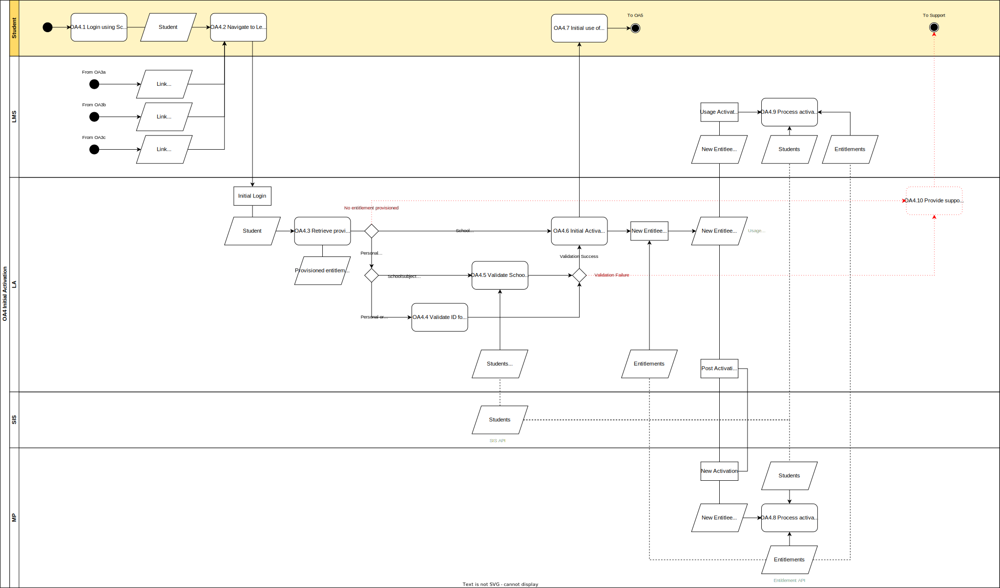

# OA.4 Initial Activation

In this process a [User](../roles/user.md) activates a digital learning material. This process is automatically started with the first login of the User for a new digital learning material.

## Roles Involved

  - [Learning Materials Provider](../roles/learning-materials-provider.md)
  - [Learning Management Provider](../roles/learning-management-provider.md)
  - [Sales Agent](../roles/sales-agent.md)
  - [User](../roles/user.md)

## Services Involved

  - [Identity Provider](../services/identity-provider.md)
  - [Learning Management System](../services/learning-management-system.md)
  - [Learning Application](../services/learning-application.md)
  - [Market Place](../services/marketplace.md)

## Basic Flow of Events

| No. | Input | Data | Process | Output |
|---|---|---|---|---|
| OA.4.1 | User | N.A. | The User logs in using the Identity Provider of the School. The Identity Provider validates the user credentials and authenticates the user. | Authenticated User |
| OA.4.2 | Authenticated User | Product Link on Learning Material List of User | The User navigates to its Learning Material List and clicks on the product link of the digital learning material he or she wants to activate. | User is send to the Learning Application with user_id, school_id, and product link |
| OA.4.3 | Authenticated User that clicked on product link | user_id for the User school_id for the School of the User School Entitlements Individual Entitlements | The Learning Application receives an initial login of the User for the digital learning material. The Learning Application retrieves the provisioning information for the requested digital learning material and evaluates if the User is entitled to activate the digital learning material. | If the User or School is entitled one of the activities OA4.4, OA4.5, OA4.6 follow next. If the User or School is not entitled than the user is send to support OA4.10. |
| OA.4.4 | Provisioned Personal entitlement or Provisioned SchoolIndividual entitlement user_id for the User | N.A. | The Learning Application validates if the user_id matches the user_id of an Entitlee of a provisioned Individual or SchoolIndividual entitlement. | If the validation is successful the User is allowed to activate the learning material in OA4.6 If the validation is not sucessful, the User is send to support in OA4.10 |
| OA.4.5 | Provisioned SchoolSubject entitlement user_id for the User | Student | The Learning Application validates if the User currently follows the SchoolSubject for which the School has a SchoolSubject entitlement. | If the validation is successful the User is allowed to activate the learning material in OA4.6 If the validation is not sucessful, the User is send to support in OA4.8 |
| OA4.6 | Provisioned School entitlement Validation success | N.A. | The Learning Application activates the digital learning material for the User. The User is added to the Usage API as a new Entitlee with InitialActivation. The Learning Application notifies the Market Place that User is added as an Active User to the provisioned entitlement within the Usage API. | Digital learning material is activated for the User Activation is send to the Market Place InitialActivation is published on the Usage API |
| OA4.7 | Activation of digital learning material for User | N.A. | The digital learning material is activated for the User. The User is able to first use the product. Most Learning Applications require some additional steps from the User to configure the product or onboard the User. | Digital learning material is configured for subsequent use by the User in OA.5 |
| OA4.8 | New Activation for Entitlement | Entitlements Students | The Market Place receives a new activation of a User for an Entitlement. This allows the Market Place to trigger administrative processes. | Example processes that could be triggered are updating the activation dashboard for the school, send a notification to the Buyer or schedule billing. |
| OA4.9 | New Activation for Entitlement | Entitlements Students | The Learning Management System listens to the Usage API and receives an InitialActivation Event from the Learning Application. This allows the Learning Management System to update the activation dashboard for the school or the User. | Activation dashboards are updated |
| OA4.10 | No provisioned entitlement found Validation failure | The User is not allowed to activate the digital learning material. The Learning Application offers support options to the User. | N.A. |

## Priority in registering a new Licensee to an Entitlement

  - SchoolIndidividual and Personal entitlements have a higher priority than the open ended School and SchoolSubject Entitlements.
  - In case there are more than one open ended School or SchoolSubject Entitlement for the product and the school, the Learning Application is allowed to determine its own priority in registering the new Licensee to one of the available Entitlements.

## Preconditions

  - Product links are available on the learning material list of the user
  - Start date of the entitlement has passed
  - ActivationUntilDate of the entitlement has not passed yet
  - Digital learning material is provisioned by the Learning Application
  - User is able to login using an Identify Provider that shares the eck_id of the user and digideliveryid of the school

## Post-conditions

  - Digital learning material is activated for the User
  - Activation is shared with the Market Place
  - Activation is optionally shared with the Learning Management System

## Next process

The flow continues with the subsequent usage of the digital learning material by a User (OA.5).