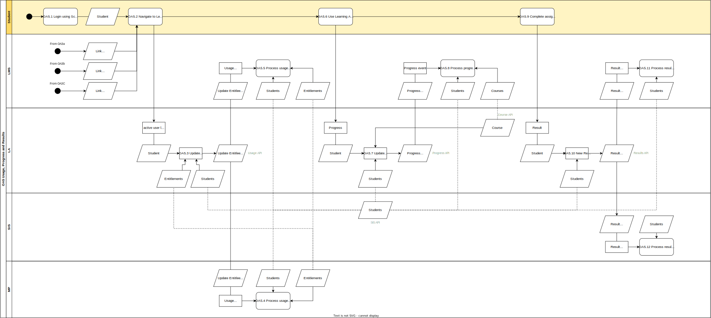

# OA.5 Usage, Progress and Results 

In this process a [User](../roles/user.md) subsequently uses an activated digital learning material. This results in usage statistics, progress information, and eventually results. The usage statistics are shared with the Market Place. Moreover usage statistics, progress information and results are optionally shared with the Learning Management System. Finally results could be shared with the School Information System. All data is exchanged only after a valid consent by the [Administrator](../roles/administrator.md) of the School.

## Roles Involved

  - [Learning Materials Provider](../roles/learning-materials-provider.md)
  - [Learning Management Provider](../roles/learning-management-provider.md)
  - [Sales Agent](../roles/sales-agent.md)
  - [User](../roles/user.md)

## Services Involved

  - [Identity Provider](../services/identity-provider.md)
  - [Learning Management System](../services/learning-management-system.md)
  - [Learning Application](../services/learning-application.md)
  - [Market Place](../services/marketplace.md)
  - [Student Information System](../services/school-information-system.md)

## Basic Flow of Events

| No. | Input | Data | Process | Output |
|---|---|---|---|---|
| OA.5.1 | User | N.A. | The User logs in using the Identity Provider of the School. The Identity Provider validates the user credentials and authenticates the user. | Authenticated User |
| OA.5.2 | Authenticated User | Product Link on Learning Material List of User | The User navigates to its Learning Material List and clicks on the product link of the digital learning material he or she wants to use. | User is send to the Learning Application with user_id, school_id, and product link |
| OA.5.3 | Authenticated User that clicked on product link | user_id for the User school_id for the School of the User | The Learning Application receives a subsequent login of the User for the digital learning material. The Learning Application checks if the User is still registered as an Active user. If so, the User is allowed to subsequently use the digital learning material. The login is added to the Usage API as an update of the LastUsed data field. In addition to the LastUsed the Learning Application could also publish other Usage statistics on the Usage API. | Usage Events |
| OA.5.4 | Usage Events | Entitlements Students | The Market Place listens to the Usage API of the Learning Application and receives a new event for an entitlement. This information can trigger administrative processes within the Market Place. | Example processes that could be triggered are updating the usage dashboard for the school, send a notification to the Buyer or schedule billing. |
| OA.5.5 | Usage Events | Entitlements Students | The Learning Management System listens to the Usage API of the Learning Application and receives a new event for an entitlement. This allows the Learning Management System to update the usage dashboard for the school or the User. | Usage dashboards are updated |
| OA.5.6 | N.A. | N.A. | The User uses the digital learning material and starts and completes assignable units and/or blocks from the course within the digital learning material. This activity results in progress information that is shared with the Learning Management System | Progress information |
| OA.5.7 | Progress information | Courses Students | The Learning Application publishes the progress information on the Progress API. | Progress Events |
| OA.5.8 | Progress Events | Courses Students | The Learning Management System listens to the Progress API of the Learning Application and receives a new Progress Event. This allows the Learning Management Sytem to update progress dashboards for Teachers and/or Students. | Progress dashboards are updated |
| OA.5.9 | N.A. | N.A. | The User uses completes an assessment which results into a new Assessment Result for the Student. | Assessment Result |
| OA.5.10 | Assessment Results | Students | The Learning Application publishes the Assessment Results on the Progress API. | Result Events |
| OA.5.11 | Result Events | Students | The Learning Management System listens to the Result API of the Learning Application and receives a new Result Event. This allows the Learning Management Sytem to register the Assessment Result into the gradebook of the Students. | Result is added to the Gradebook of the Student |
| OA.5.12 | Result Events | Students | The School Informaton System listens to the Result API of the Learning Application and receives a new Result Event. This allows the Student Information Sytem to register the Assessment Result into the gradebook of the Students. | Result is added to the Gradebook of the Student |

## Preconditions

  - Product links are available on the learning material list of the user
  - Digital learning material is activated for the User
  - License is still active, Expiration date has not passed yet
  - User is able to login using an Identify Provider that shares the eck_id of the user and digideliveryid of the school
  - The school Administrator has given consent to the Learning Management System for exchange of Usage, Progress, and Results data from the Learning Application. [C.3]()
  - The school Administrator has given consent to the Student Information System for exchange of Results data from the Learning Application. [C.4]()

## Post-conditions

  - Usage statistics are shared with the Market Place
  - Usage statistics are shared with the Learning Management System, Usage dashboards are updated
  - Progress information is shared with the Learning Management System, Progress dashboards are updated
  - Assessment Results are registered within the gradebook of the Learning Management System and/or the Student Information System

## Next process

This is the last process within the Order and Access flow.