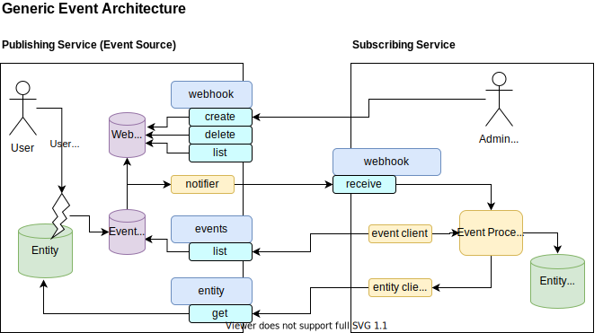

# Technical reference documentation

## Key technical principles

TODO: Describe the technical principles

#### 1. No mandatory central services, participants exchange information directly. Note data for a given school under the direct control of the school where appropriate
    - Simplified eco-system focused around the needs of a specific school and under their control
    - No central infrastructure that needs to be maintained and holds back all services based on its roadmap   
    - Simple entrance for new participants to any service 
    - Assumes high trust between participants through transparancy
    
#### 2. There can be multiple identity providers . We will use the ECK-ID to allow matching of students across them over time. Mechanisms are needed for schools and teachers	
    - Service providers (such as SIS vendors) are an ideal source of identity for schools, and can be relied upon within a schools ecosystem. Note a SIS is not equal to an IdP
    - Services such as those provided by Kennisnet can also be used, though are not strictly required
    
#### 3. Business model agnostic; can support pre-pay (transactional or subscription), freemium or usage based post-pay
    - While optimized for school start based on a LML, it can support other models
    - Flexibility for participants to offer products under any model they choose via any route they choose
    
#### 4. Based on a set of clear services that anyone can choose to provide to the ecosystem, and a single company may provide one or more services
    - No central control point that inhibits any single company (or small group) from controlling the ecosystem and stifling innovation
    - Freedom to compete in the provision of any service
    - Data is shared directly between services and can be cached for performance and reliability
    - Each service is responsible for its own redundancy and reliability
    
#### 5. Schools will be free to choose any services
    - Schools have the choice to use multiple providers for each service based on what suits their needs
    - Schools should be able to add / remove services during the school year
    
#### 6. Data will always be provided from the source, and not passed between services. It is always clear who is responsible for the data and that it is provided in a transparent way
    - Services can rely on data being correct and timely to avoid manual administration by schools
    - Innovation can happen on top of services that schools have already invested in
    - Data should be exchanged on “need to know basis”,  and binded to the purpose (goal binding/GDPR requirement or doelbinding/AVG eis)
    
#### 7. Data will be exchanged based on minimum required for delivery of services and data privacy

#### 8. Not have administration in the lead, always ensure access is possible
    - Ensure that users are always able to access material where they are entitled to.
    - No stock levels for digital products
    
#### 9. Need to be closed money goods flow
    - Usage of ‘goods’ means that money is/needs to be transferred to the one who is providing.

## Architecture

A working description of the architecture is contained in this [issue](https://github.com/stichtingsem/technology-prototype/issues/7).

TODO: Finalize the discussion and describe the definite architecture in this paragraph

## Webhooks and events

TODO: Explain the architectural model and the usage of webhooks and events.

A simple overview of a generic exchange is as follows, note that while this may look complex at first glance, it is a common pattern used in the B2B software space and is straight forward to implement on both sides of the exchange:

## Security by design using open standards

The security and data minimization approach is outlined here: [security](https://github.com/stichtingsem/technology-prototype/issues/18)

TODO: Finalize the discussion and describe the definite security aspects in this paragraph

## Other relevant standards

TODO: Describe all relevant standards for parties that want to join the ecosystem.

## Information model

TODO: What is the underlying information model used within the ecosystem?

## APIs

TODO: Describe and refer to the API definitions